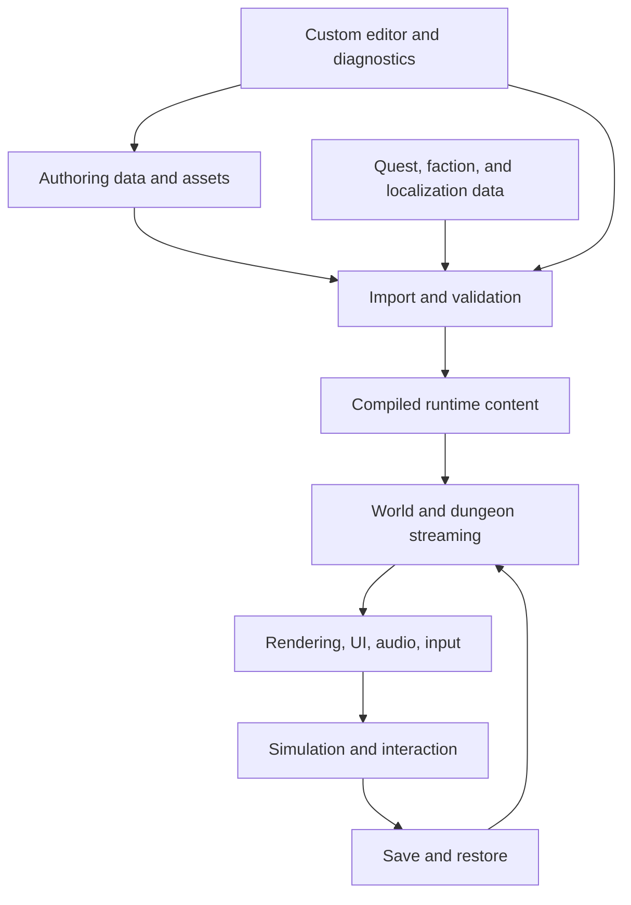
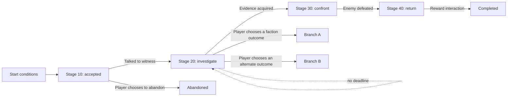
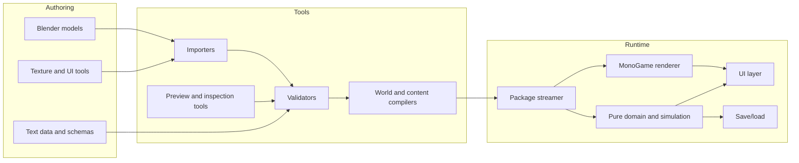

# Daggerfall Scope and Build Research

**Date:** 2026-08-22  
**Project direction:** Ratna Bay — MonoGame + code-first tools  
**Reference paths inspected:**

- `D:\Games\Daggerfall`
- `D:\Games\Unity Daggerfall`

## Executive conclusion

Studying Daggerfall is valuable, but we should study it as a layered production system rather than attempt to reproduce its entire content footprint immediately.

The most important lesson is that a game at this scale is not just a renderer. It is a coordinated set of systems and content factories:



MonoGame is a reasonable fit for Ratna Bay because it gives us control over the runtime and encourages code-first architecture. The cost is that we must own the renderer, scene/world representation, UI framework, content importers, editors, validation, streaming, save format, and debugging tools that Unity would normally provide.

The correct strategic target is therefore:

1. Build a small, inspectable vertical slice.
2. Build the tools that make the slice repeatable.
3. Expand the systems only after the content pipeline can produce and validate them.
4. Grow world breadth only when the runtime and authoring workflows are stable.

## Scope-limiting policy

The project should be governed by explicit exclusions. A feature is not automatically justified because MonoGame can technically support it. It must support the core player loop, fit the production capacity, and have a clear owner in the pipeline.

### Hard exclusions for the first product scope

| Exclusion | Policy | Reason |
|---|---|---|
| Time-bound quests | No quest expires because a number of in-game hours or days passed. Quest progression is stage-bound and event-bound. | Removes clock pressure from quest state, testing, save/load, and player experience. |
| Public mod support | No public mod SDK, plugin API, mod package format, or compatibility promise. | Avoids designing and supporting a second product before the core game is stable. |
| Procedural dungeons before the slice | The vertical slice uses one deliberate, authored dungeon. Procedural dungeon generation starts only after the slice proves movement, combat, interaction, quest state, streaming, and save/reload. | Prevents generation from hiding weaknesses in the basic level and quest workflows. |
| Continent-scale world | The initial game has one region with a deliberately small travel footprint. | Keeps rendering, streaming, navigation, content density, and testing bounded. |
| Radiant quest generation | No generic “generate a quest for any target/location” system in the first release scope. | It multiplies validation and narrative problems before the hand-authored quest model is proven. |
| Arbitrary quest scripting | Quest content uses declarative stages, conditions, events, role bindings, objectives, and a constrained action vocabulary. | Prevents a fragile scripting language from becoming the game’s hidden architecture. |
| Full NPC schedules | No day/night schedule simulation in the first slice. NPCs use a small set of intentional states such as idle, conversation, combat, and travel-to-target. | Avoids building a second simulation game before the core loop works. |
| Cinematic scene system | No general-purpose multi-actor cutscene editor in the first slice. | Dialogue and world interactions prove the narrative loop at lower cost. |
| Broad voice production | Dialogue is text-first; no voice-acting pipeline is required for the first release target. | Reduces content lock, localization, iteration cost, and storage. |
| Multiplayer and online services | Not part of the product. | Protects the architecture from networking, account, service, and synchronization scope. |

### What remains allowed

These exclusions do not mean the architecture should be careless. We should still build:

- Stable internal data schemas.
- Versioned save files.
- Deterministic content validation.
- An internal package/build pipeline.
- A renderer that can eventually stream regions.
- A quest model that can eventually support branches and optional objectives.

The distinction is between **internal extensibility** and **promised product features**. We can leave room for future systems without committing to build, document, test, and support them now.

### Scope review gates

Any proposed feature must answer these questions before entering the backlog:

1. Does it improve the first player loop?
2. Does it require a new runtime system, data format, tool, or test surface?
3. Can it be implemented using the existing stage/event/content model?
4. What existing feature will be delayed or removed to pay for it?
5. Is it an internal capability or a player-facing promise?

If the answer to question four is “nothing,” the feature is not yet scoped honestly.

## What was actually inspected

### Original Daggerfall data folder

`D:\Games\Daggerfall` is a data installation rather than a complete development repository. It contains:

- `arena2`, with 1,680 files and approximately 0.50 GiB of data.
- Empty `SAVE0` through `SAVE5` directories.
- No source code or executable at the folder root.

The dominant data groups are:

| Group | Observed count | What it tells us |
|---|---:|---|
| `.QBN` | 306 | Quest logic or behavior data is stored separately from dialogue/resources. |
| `.QRC` | 303 | Quest conversations, messages, or resource text are a distinct layer. |
| `.IMG` | 263 | Many 2D/UI/flat image resources exist outside the 3D world data. |
| `.TXT` | 109 | Human-readable configuration, biographies, faction data, and text resources are part of the install. |
| `.CIF` | 70 | Character/creature image resources are represented in a dedicated format. |
| `.DAT` | 47 | Tables, world/runtime data, skies, lighting, and other binary data are grouped in structured files. |
| `.CFG` | 20 | Classes, flats, and other definitions are data-driven. |
| `.VID` | 17 | Video/cinematic or large sequential media resources are separate from ordinary assets. |
| `.FLC` | 16 | Animation/cinematic resources use a dedicated format. |
| `.BSA` | 5 | Large collections of 3D, block, map, monster, and other assets are packed into archives. |
| `.WLD` | 3 | World/region-level data is stored separately from local art and UI assets. |

Representative large files include `BLOCKS.BSA`, `ARCH3D.BSA`, `MAPS.BSA`, `WOODS.WLD`, `PACKED.DAT`, and multiple `SKYxx.DAT` files. This is evidence of a content system built around compact, purpose-specific formats and archives rather than loose editor objects.

### Daggerfall Unity installation

`D:\Games\Unity Daggerfall` contains a Windows player build:

- `DaggerfallUnity.exe`
- `DaggerfallUnity_Data`
- `MonoBleedingEdge`
- `DaggerfallUnity_Data\Managed\Assembly-CSharp.dll` at approximately 3.2 MB
- Unity 2019.4.40 player metadata
- Unity asset containers such as `globalgamemanagers`, `resources.assets`, `sharedassets`, and `level0`/`level1`

The folder contains **zero** `.cs`, `.sln`, `.csproj`, `.unity`, `.prefab`, `.asmdef`, `Assets`, or `ProjectSettings` source indicators. It is therefore not the Daggerfall Unity source project and cannot reveal the original C# architecture directly. The compiled assembly should not be treated as a substitute for source review or decompiled into Ratna Bay code.

The build is still useful because its `StreamingAssets` directory exposes the runtime content contract:

| Directory | Observed contents | Architectural implication |
|---|---|---|
| `GameFiles` | Readme describing `ARENA2` and `SAVE0`–`SAVE5` | Classic data and saves are external inputs, not necessarily baked into the player. |
| `Quests` | 265 text files | Quest scripts are data-driven and independently replaceable. |
| `Tables` | Quest/faction/item/place/spell/global-variable tables | Runtime systems depend on stable lookup tables and symbolic IDs. |
| `Text` | Books, localization CSVs, and quest text | Presentation data is separated from executable logic. |
| `BIOGs` | 18 biography templates plus documentation | Character creation/backstory is replaceable content. |
| `Factions` | Human-readable faction definitions | Faction relationships and NPC identity are data-driven. |
| `Textures` | Replacement folders for `IMG`, `CIF`, and `RCI` resources | Asset replacement is supported through naming and type conventions. |
| `WorldData` | Replacement-data location | World generation/replacement is an explicit extension surface. |
| `Mods` and `QuestPacks` | Package locations and documentation | Mod content is a first-class delivery concern. |
| `aa` | Unity Addressables catalog/settings/bundles | Some content is delivered through a separately addressable asset layer. |

The build also contains five font files, 95 book files under `Text\Books`, 13 master localization CSV files, 264 quest-like text files plus support files, and a large compiled Unity asset layer. These counts describe the installed build, not the full historical development repository.

## Architectural lessons from the two versions

### 1. The original game separates content by responsibility

The classic file set suggests a strong division between:

- World and region data.
- Local 3D/architectural resources.
- Character and creature resources.
- UI, fonts, books, and text.
- Quest behavior and quest presentation.
- Classes, factions, items, spells, and lookup tables.
- Save data and persistent world state.

For Ratna Bay, this should become explicit C# schemas and compiled data packages instead of a large general-purpose scene graph.

### 2. Quest behavior and dialogue should not be one opaque blob

The paired `.QBN`/`.QRC` pattern is a useful design lesson. A quest system should distinguish:

- Conditions, timers, state transitions, and consequences.
- Actors, locations, factions, and item references.
- Dialogue, journal text, rumors, and localized presentation.

Our implementation can use typed JSON/YAML or a custom text format during authoring, then compile to compact binary or indexed runtime data. The runtime should never need to parse arbitrary authoring text during gameplay.

### 3. External data is a deliberate boundary

Daggerfall Unity's `GameFiles` documentation shows a clean boundary between the player and the original game data. Ratna Bay should use the same idea for our own content:

- Source assets stay in authoring folders.
- Tools validate and compile them.
- The game loads versioned runtime packages.
- Reference-game data is optional and read-only, never a normal build dependency.

This boundary will make builds reproducible, allow automated validation, and prevent accidental inclusion of reference assets.

### 4. Streaming is a product feature, not a late optimization

The combination of regional world data, large archive files, dungeon blocks, and separate Unity asset delivery implies that the world must be loaded in pieces. Ratna Bay should define streaming units early:

- Exterior world region/chunk.
- Town or settlement package.
- Dungeon package.
- Interior building package.
- Shared global package for definitions, fonts, UI, and common materials.

Each unit should have an identifier, dependency list, bounds, version, memory estimate, and validation report.

### 5. A custom tools program is central to the project

The original game’s compact formats and Daggerfall Unity’s replacement/mod folders both point toward tooling as a major project area. We should treat tools as a product used by the team:

- Inspect and validate source assets.
- Compile world and dungeon data.
- Build searchable indexes for entities, locations, quests, factions, and items.
- Preview collision, navigation, lighting, portals, and spawn points.
- Generate runtime packages.
- Produce reports that explain exactly what is broken.

## Scope assessment

The visible game experience can look deceptively simple because the art style is low-poly and the classic interface is mostly 2D. The underlying scope is large because the game combines a very broad world with persistent simulation and procedural/templated content.

| System area | Daggerfall-level expectation | Ratna Bay scope decision |
|---|---|---|
| Rendering | First-person 3D, sky, lighting, sprites/meshes, materials, effects | Build a focused renderer with a stable asset contract; add advanced effects only after the slice works. |
| World | Large overworld, regional identity, travel, locations, roads, terrain | Start with one authored region and a few locations; design IDs and chunking to scale later. |
| Dungeons | Modular, interconnected interiors with mapping and persistence | Start with one handcrafted dungeon grammar and a small number of reusable modules. |
| Character creation | Classes, skills, attributes, biography/backstory, equipment | Implement only the minimum set required by the first playable loop. |
| Combat | Real-time movement, attacks, hit detection, damage, defenses, status effects | Build one weapon family, one enemy family, and one reliable damage loop first. |
| Magic | Spell definitions, casting, effects, costs, resistances, feedback | Defer breadth; build a data-driven effect model with a few representative spells. |
| NPCs and AI | Schedules, roles, factions, enemies, interactions, persistence | Begin with stationary NPCs, one hostile AI, and explicit faction/reputation data. |
| Quests | Hundreds of scripts, variables, timers, dialogue, factions, locations, rewards | Prove the quest state machine with two short quests before building authoring UX. |
| Economy | Shops, gold, repairs, services, item pricing, inventory | Add only the services needed for the vertical slice. |
| UI | HUD, inventory, character sheet, map, automap, dialogue, journal, settings | Build a reusable immediate-mode or retained UI layer with a small design system. |
| Persistence | Character, inventory, quest state, world state, time, location, settings | Define the save schema before adding many systems; version it from the first save. |
| Audio | Music, effects, ambient loops, sound fonts or equivalent | Keep behind an interface so the runtime does not depend on one audio backend. |
| Modding | Replacement assets, quest packs, localization, world replacement | Design package manifests and validation now; postpone public mod support until the core schema stabilizes. |
| Tooling | Inspectors, importers, compilers, previews, diagnostics | Treat this as a core workstream, not a convenience task. |

### Scope tiers

#### Tier 1 — Vertical slice

The first goal is not a continent. It is a complete, repeatable loop:

1. Create or load a character.
2. Enter one small town or settlement.
3. Speak to an NPC.
4. Accept one quest.
5. Travel to one nearby location.
6. Enter one dungeon or interior.
7. Fight one enemy type.
8. Complete or fail the quest.
9. Return, receive a reward, save, quit, reload, and observe correct state.

This slice proves the architecture and exposes the highest-risk dependencies: camera/rendering, collision, interaction, data lookup, quest state, UI, streaming, and persistence.

#### Tier 2 — Systemic foundation

Expand the slice into reusable systems:

- Multiple regions and location types.
- A stable item/equipment model.
- Several enemy and NPC archetypes.
- Factions and reputation.
- A quest compiler and debugger.
- Dungeon modules and deterministic generation.
- Versioned save files.
- Automated content validation.

#### Tier 3 — Daggerfall-style breadth

Only after Tier 2 is stable should we pursue broad world coverage, many guilds/factions, large quest libraries, multiple dungeon themes, extensive localization, and a large travel map. Public mod support remains outside the product scope.

## Bethesda quest-structure research

The exact internal Bethesda implementation is proprietary, so this section separates public evidence from our design inference. The public Creation Kit documentation and Bethesda-published interviews are sufficient to identify a useful mental model, but they do not constitute a complete description of the production code behind every Elder Scrolls or Fallout title.

### Publicly observable building blocks

The Creation Kit’s publicly documented quest concepts include:

| Concept | Publicly documented behavior | Ratna Bay interpretation |
|---|---|---|
| Quest | A persistent unit that can start, run, stop, and expose state to scripts. | A named story/system contract with durable state and terminal outcomes. |
| Stage | A numbered progression point; entering a stage can run fragments and update the journal. | A milestone in the quest state machine. It is not a timer. |
| Objective | A player-facing task that can be displayed and completed independently of the stage itself. | A readable instruction inside a stage, with completion events and optionality. |
| Alias | A role that can be filled by a reference selected from the world when the quest starts or updates. | A role binding such as quest giver, target, destination, evidence, enemy, or rewarder. |
| Condition | A predicate used to control availability, dialogue, alias filling, package behavior, or transitions. | A small, typed expression system evaluated against player/world state. |
| Fragment/script | Code or actions that run when a quest/stage/object event occurs. | A constrained action list first; custom code only when the core vocabulary cannot express the behavior. |
| Package | Actor behavior built from procedures and conditions, such as travel, follow, acquire, or hold position. | An actor-behavior layer separate from quest progression. Start with a small behavior set. |
| Scene | A coordinated interaction between actors, often connected to quest/dialogue state. | A future orchestration feature, explicitly outside the first slice. |

The Creation Kit documentation describes stage fragments as running when stages start, quest objectives as separately trackable, and aliases as being filled as a quest starts. It also documents packages as compositions of procedures with data inputs and conditions. These are the most useful structural ideas to carry forward, not the editor’s exact terminology or scripting language.

Bethesda’s public interview with lead quest designer Will Shen adds the design-side perspective: quest work combines writing, scripting, tool implementation, cross-discipline problem solving, repeated playthroughs, and a complete mental picture of the quest before committing it to the tool. He also describes choices as a relationship between what the player does and how allies or enemies respond, with skills, background, combat, and non-combat activities influencing the experience. This supports designing quests as responsive world state rather than a sequence of dialogue screens.

### The Bethesda-like mental model

The simplest useful mental model is:



In Ratna Bay, a quest should be understood as a **persistent contract between the player and the world**:

1. The quest declares when it can become available.
2. The quest binds roles to world entities.
3. The current stage describes the story state.
4. Objectives explain what the player can do next.
5. World events, dialogue choices, and interactions request stage transitions.
6. Stage entry applies consequences and updates presentation.
7. The quest remains at its current stage until an allowed transition occurs.
8. The save system records the state in a versioned form.

This is compatible with the agreed scope limit: a quest can remain at an investigation stage indefinitely. It advances because the player performs the relevant action, not because a clock expired.

### Ratna Bay quest model

The initial data model should be deliberately smaller than Papyrus or a general visual scripting system:

```text
QuestDefinition
  id
  title
  startConditions
  roles
  variables
  stages
  rewards

QuestRole
  id
  kind: actor | location | item | faction | evidence
  selector
  required: true | false

QuestStage
  id
  journalText
  objectives
  onEnterActions
  transitions
  terminal: none | success | abandoned

QuestObjective
  id
  text
  optional
  completionEvent

QuestTransition
  targetStage
  event
  conditions
  actions
```

The initial action vocabulary should contain only actions we can test and inspect:

- Set or clear a quest variable.
- Bind or release a role.
- Display or complete an objective.
- Give or remove an item.
- Change faction/reputation value.
- Spawn, despawn, enable, or disable a known encounter.
- Move the player or an actor only when explicitly required by a designed interaction.
- Set the next quest stage.
- Emit a journal, dialogue, or world-event notification.

The vocabulary should not include arbitrary C# or an embedded general-purpose script language in the first slice.

### Quest types we should support first

| Type | Use in first slice? | Structure |
|---|---|---|
| Linear authored quest | Yes | One primary stage path with explicit terminal success/abandonment. |
| Small branch | After the first linear quest works | Two or three meaningful outcomes, not a combinatorial branch tree. |
| Investigation quest | Yes, if needed | Evidence and dialogue events move the player through stages; no deadline. |
| Fetch/recover quest | Yes | Acquire a known item or evidence, then return it or make a choice. |
| Combat quest | Yes | Enter encounter, defeat/resolve target, apply consequence, return or conclude. |
| Faction quest | After faction state exists | Role bindings and reputation conditions, but keep the chain short. |
| Radiant quest | No | Revisit only after authored quests, locations, and validation are mature. |
| Time-critical quest | No | Explicitly excluded; use stage-bound urgency in dialogue or objectives instead. |

### What we should borrow from Bethesda

- Treat the quest as a durable state machine.
- Keep stages readable and meaningful.
- Separate player-facing objectives from internal state.
- Bind roles to world entities instead of hard-coding every reference.
- Let dialogue, world interactions, combat, and exploration emit quest events.
- Keep actor behavior separate from quest progression.
- Test quests through repeated play from fresh saves and intermediate saves.
- Design the location and travel distance before finalizing objective pacing.
- Play the quest as a player, not only as its author.

### What we should not borrow yet

- A large general-purpose scripting surface.
- Highly dynamic radiant quest selection.
- Complicated scene/cinematic orchestration.
- Full NPC daily schedules.
- Quest chains with many simultaneous global dependencies.
- Time-based failure and deadline systems.
- A public quest/mod authoring API.

## Quest design and implementation workflow

The director-level workflow should be:

1. **One-sentence hook** — What unusual situation makes this quest worth playing?
2. **Player role** — What does the player believe they are doing?
3. **World conflict** — Which people, factions, locations, or forces disagree?
4. **Location pass** — Define the actual places, travel distance, entrances, exits, and encounter spaces.
5. **Stage table** — Write the stages, objectives, events, conditions, consequences, and terminal outcomes before dialogue polish.
6. **Role map** — List the quest giver, targets, evidence, locations, enemies, faction references, and rewards.
7. **Dialogue pass** — Write only the dialogue needed to make each stage legible and meaningful.
8. **Data implementation** — Enter the declarative quest definition and validate all references.
9. **Playtest pass** — Play from the beginning repeatedly and deliberately test unexpected orderings.
10. **Save/reload pass** — Load at every stage boundary and verify the world, roles, objectives, and dialogue remain coherent.

This workflow is also consistent with the scope decision: one good authored quest provides more architectural information than a generator producing dozens of shallow quests.

## Recommended Ratna Bay architecture



### Runtime layers

1. **Domain** — deterministic rules, entities, items, quests, factions, time, combat, and persistence models. It should be testable without a graphics device.
2. **World** — regions, locations, chunks, dungeon graphs, portals, spawn points, and streaming state.
3. **Rendering** — camera, meshes, textures, materials, lighting, sprites, particles, and post-processing.
4. **Interaction** — targeting, doors, containers, dialogue, pickups, combat input, and contextual actions.
5. **UI** — HUD, inventory, character sheet, map, dialogue, journal, menus, settings, and diagnostics.
6. **Tools** — import, validate, compile, preview, inspect, and package commands.

### Authoring versus runtime formats

Authoring formats should be easy for people and tools to edit. Runtime formats should be fast, validated, indexed, and versioned.

Recommended flow:

```text
content/source/
  world/
  locations/
  dungeons/
  entities/
  quests/
  localization/
  assets/

content/generated/
  validation-reports/
  indexes/
  previews/

content/runtime/
  manifest.json
  shared.ratpak
  regions/*.ratpak
  dungeons/*.ratpak
```

The reference folders `D:\Games\Daggerfall` and `D:\Games\Unity Daggerfall` should never be placed under these directories or copied into a release package.

## Game-director planning model

### Creative pillars

Before building breadth, Ratna Bay should commit to three or four pillars. A reasonable starting proposal is:

1. **A world that feels larger than the player can fully memorize.**
2. **Systems that create stories through interactions, factions, and consequences.**
3. **Readable low-poly 3D with a strong, consistent interface language.**
4. **A content pipeline that lets a small team expand the world safely.**

Every feature should explain which pillar it serves. Features that serve none should be deferred.

### Product definition

The director should write down:

- The intended player and platform.
- The camera and movement model.
- The tone and visual constraints.
- The minimum release experience.
- What “Daggerfall-like” means for this project and what it does not mean.
- Which parts are authored, procedural, or hybrid.
- The acceptable level of simulation and persistence.
- The modding promise, if any, and when it becomes supported.

### Workstream ownership

Even in a small team, track these as separate workstreams:

| Workstream | First responsibility |
|---|---|
| Direction and design | Pillars, player loop, feature priorities, acceptance criteria. |
| Runtime engineering | Domain, world, renderer, input, UI, save/load. |
| Tools and pipeline | Import, validation, compilation, preview, packaging, diagnostics. |
| Content design | Regions, locations, quests, factions, items, enemy roles, pacing. |
| Art and presentation | Blender models, textures, UI visuals, animation, readability. |
| QA and release | Golden fixtures, regression tests, performance budgets, build checks. |

The director’s job is to protect dependencies and sequencing. Content breadth should not outrun the tools that validate and package it.

## Milestones and exit gates

### Gate 0 — Foundation

**Deliverables:** solution structure, deterministic domain tests, MonoGame window, asset build, tool doctor, source-control rules.

**Exit criteria:** a clean checkout restores, builds, validates, and runs on the target development machine.

### Gate 1 — Renderer and interaction proof

**Deliverables:** 3D camera, one imported model, texture/material, collision, basic lighting, input, one interaction prompt, basic UI.

**Exit criteria:** the player can move through a small authored room and interact with at least one object without editor-only setup.

### Gate 2 — Vertical slice

**Deliverables:** one settlement, one nearby exterior area, one dungeon, one NPC, one enemy, one quest, inventory, reward, save/reload.

**Exit criteria:** the complete player loop works from a clean runtime package and survives save/reload.

### Gate 3 — Content factory

**Deliverables:** source schemas, importers, validators, world compiler, dungeon compiler, quest compiler, preview tools, package manifests, regression fixtures.

**Exit criteria:** a new location and quest can be added without hand-editing generated runtime files or scene internals.

### Gate 4 — Systemic expansion

**Deliverables:** more factions, items, enemies, dungeon modules, locations, services, travel, time, and world-state rules.

**Exit criteria:** content growth does not cause unacceptable load times, memory use, save corruption, or validation noise.

### Gate 5 — Breadth and release

**Deliverables:** larger world, content library, localization, audio pass, accessibility, packaging, crash reporting, mod support if promised.

**Exit criteria:** release candidate passes technical, content, usability, and performance checklists.

## Immediate work plan

### Next implementation sequence

1. Add a small 3D renderer proof to `RatnaBay.Game`.
2. Add a minimal content manifest and package version type to `RatnaBay.Domain`.
3. Add a `content/source` fixture containing one room, one entity, one quest, and one localization entry.
4. Add `RatnaBay.Tools` commands for `content validate` and `content build`.
5. Import one Blender-authored glTF or equivalent asset through a controlled process.
6. Build a deterministic region/chunk loader.
7. Implement the first vertical-slice interaction and save/reload test.
8. Only then decide whether to add an editor UI, a dungeon graph editor, or a world map editor first.

### Reference-study workstream

The reference study should remain isolated from normal game builds:

1. Add a future `reference inspect` command that reads a configured external path.
2. Report file counts, extensions, sizes, and recognized structural families.
3. Parse only safe structural metadata into neutral reports and fixtures.
4. Do not write converted Daggerfall assets into `content/runtime`.
5. Use public Daggerfall Unity source separately for architecture reading when the source checkout is available.

Suggested environment variable:

```powershell
$env:RATNABAY_DAGGERFALL_REFERENCE = 'D:\Games\Daggerfall'
```

The Unity installation can be used as a second reference path, but because it is a player build it should be labeled as `compiled-player-reference`, not `unity-source-reference`.

## Decisions and non-decisions

### Decisions

- MonoGame remains a viable runtime choice for this project.
- We will build code-first runtime and tools around explicit data contracts.
- Blender is the first community 3D tool in the pipeline.
- Reference-game files remain external, read-only, and excluded from releases.
- The first success metric is a complete vertical slice, not a giant map.
- Generated files are disposable build outputs and should not be hand-edited.

### Deferred decisions

- Exact 3D model interchange format and runtime mesh format.
- Custom editor technology: desktop UI, web UI, or in-game tools.
- Physics library and navigation approach.
- Shader/post-processing scope.
- Public mod package format.
- Whether world generation is mostly authored, procedural, or hybrid.

These decisions should be made after Gate 1 exposes the actual runtime constraints.

## Risks

| Risk | Why it matters | Mitigation |
|---|---|---|
| Rebuilding editor functionality | Code-first removes Unity’s scene and inspector workflows. | Build narrow tools around the first slice; do not attempt a universal editor. |
| World-scale streaming | Large worlds can fail through memory spikes, stalls, or poor persistence. | Define chunk/package contracts and measure from the first region. |
| Quest complexity | Data-driven quests become difficult to debug when variables and timers interact. | Typed schemas, deterministic tests, quest trace logs, and a debugger. |
| Content explosion | Breadth can consume the project before the core loop is fun. | Gate content expansion behind the vertical slice and content factory. |
| Asset pipeline drift | Manual exports create inconsistent runtime results. | Versioned import settings, validation, manifests, and reproducible builds. |
| Reference contamination | Copying original assets or text can create legal and technical problems. | Keep reference paths external and use neutral fixtures only. |
| Missing Unity source | The installed Unity folder cannot answer source-level architecture questions. | Review the public Daggerfall Unity source separately and record version/commit. |

## Research limitations and next evidence needed

This local review establishes the data boundary and installed-player structure. It does not establish the internal Daggerfall Unity class graph because the source project is not present at `D:\Games\Unity Daggerfall` or elsewhere under `D:\Games`.

For a deeper implementation comparison, the next evidence should be:

- A checked-out, versioned Daggerfall Unity source repository.
- Its `Assets`, `ProjectSettings`, package manifests, editor scripts, and runtime scripts.
- Public documentation for its world streaming, dungeon generation, mod, and quest systems.
- A small set of neutral Ratna Bay fixtures derived from observed concepts, not copied assets or text.

## Reference links

- [Daggerfall Unity repository](https://github.com/Interkarma/daggerfall-unity)
- [Daggerfall Unity roadmap](https://www.dfworkshop.net/projects/daggerfall-unity/roadmap/)
- [Daggerfall Unity world streaming discussion](https://www.dfworkshop.net/streaming-world-part-2/)
- [MonoGame documentation](https://docs.monogame.net/)
- [MonoGame content pipeline documentation](https://docs.monogame.net/articles/content/)

### Bethesda quest references

- [Bethesda: Meet Will Shen, Lead Quest Designer on Starfield](https://bethesda.net/en-US/news/meet-will-shen-lead-quest-designer-on-starfield-at-bethesda-game-studios)
- [Bethesda: Monthly Modder — Jonx0r](https://bethesda.net/en-US/news/monthly-modder-jonx0r)
- [Creation Kit Wiki: Quest stages](https://ck.uesp.net/wiki/SetStage_-_Quest)
- [Creation Kit Wiki: Quest stage fragments](https://ck.uesp.net/wiki/Quest_Stage_Fragments)
- [Creation Kit Wiki: Starting quests and alias filling](https://ck.uesp.net/wiki/Start_-_Quest)
- [Creation Kit Wiki: Packages and procedures](https://ck.uesp.net/wiki/Category:Procedures)
- [Creation Kit Wiki: Quest design tutorials](https://ck.uesp.net/wiki/Category:Tutorials)

The Creation Kit links above are community-maintained documentation. Bethesda’s own support page points users to the Creation Kit Wiki and UESP while the official wiki is under maintenance, so we use those pages as public technical references rather than as proprietary source material.

## Bottom line

Daggerfall teaches us that the winning architecture is a compact runtime backed by strong data formats, streaming boundaries, deterministic systems, and specialized content tools. Daggerfall Unity demonstrates the value of wrapping legacy data with modern replaceable content and mod boundaries, but the installed folder reviewed here is only a compiled player.

Ratna Bay should aim for the same systems thinking while deliberately starting smaller: one complete region, one dungeon, one quest loop, one save format, and a pipeline that can reproduce the result from source. That gives the game director a meaningful decision point before committing to Daggerfall-scale breadth.
