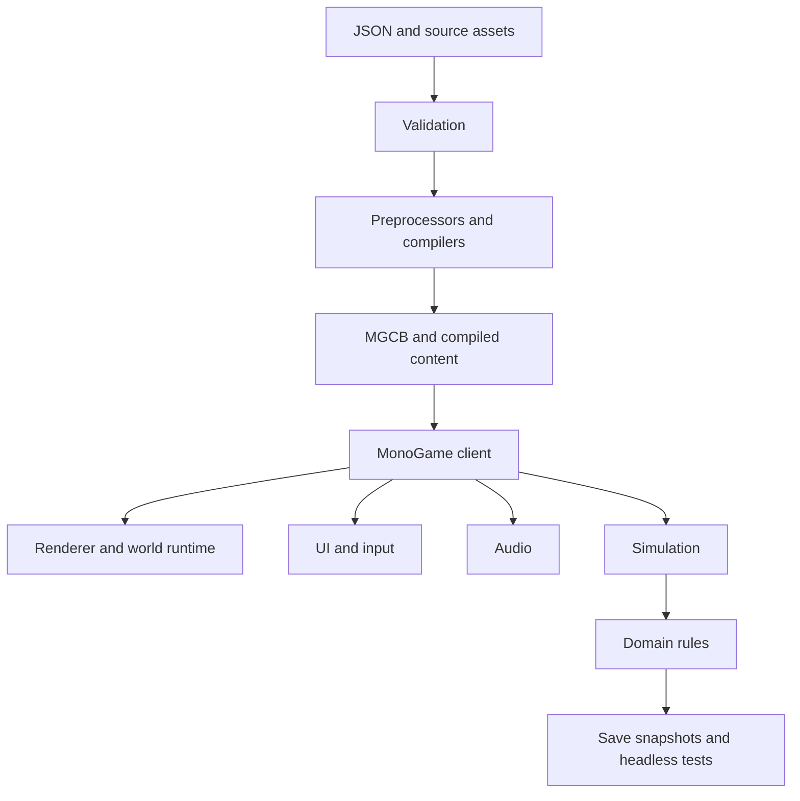

# Ratna Bay MonoGame pivot plan

**Date:** 2026-08-22  
**Status:** initial implementation baseline  
**Runtime:** MonoGame 3.8.5.1, WindowsDX, .NET 9 game client  
**Archive:** `D:\Projects\Elder Scrolls 6_Unity_Archive_2026-08-22`

## Decision

The Unity project has been moved intact to the archive path above. The current Git
repository remains at `D:\Projects\Elder Scrolls 6`, but its working tree now contains
the new MonoGame implementation. The archive is outside the working tree so it cannot be
mistaken for live production content.

MonoGame is being used as a framework, not treated as a replacement Unity editor. The
project will own its game state, world data, region compiler, UI, renderer, preview tools,
and validation pipeline.

The initial target is a Windows-first, first-person, low-poly/retro 3D RPG. Cross-platform
DesktopGL remains an option after the Windows slice is stable. The official MonoGame
templates and content tools are installed at version 3.8.5.1.

## Repository shape

```text
RatnaBay.sln
├─ src/
│  ├─ RatnaBay.Domain/          engine-independent rules and save contracts
│  └─ RatnaBay.Game/            MonoGame WindowsDX client and Content.mgcb
├─ tools/RatnaBay.Tools/        validators and authoring commands
├─ tests/RatnaBay.Domain.Tests/ headless domain tests
├─ Docs/
└─ build.ps1
```

## Principles

1. **Data is authoritative.** JSON and compiled data artifacts define the world. Runtime
   objects are derived from data and stable IDs.
2. **Domain code is engine-free.** Quest rules, dialogue, inventory, combat, story state,
   and save migrations cannot reference MonoGame.
3. **Generated content is reproducible.** Every generated output records its source, seed,
   generator version, and input hash.
4. **The build is a product.** A clean checkout must restore, validate, build, test, and
   package without opening an editor.
5. **The game must be observable.** Every milestone gets a deterministic screenshot or
   scripted playthrough gate.
6. **Tools serve the current slice.** Generalize a tool only after it has been used
   successfully on real Ratna Bay content.

## Architecture



### Projects

#### `RatnaBay.Domain`

Pure C# only:

- stable IDs and identifiers;
- world and location contracts;
- character profile, attributes, skills, equipment, and inventory;
- dialogue topics and conditions;
- quests, stages, choices, evidence, and story flags;
- combat and spell rules;
- save DTOs, schema versions, migrations, and validation.

#### `RatnaBay.Game`

MonoGame-specific client:

- game loop and state machine;
- input contexts and timing;
- content loading;
- camera, renderer, materials, shaders, billboards, and sprites;
- world and interior runtime;
- collision and movement;
- audio playback;
- UI screens and overlays;
- screenshot and runtime diagnostics.

#### `RatnaBay.Tools`

Headless command-line tooling:

- data schema validation;
- world manifest compilation;
- region/chunk generation;
- dungeon graph validation;
- asset manifest and license checks;
- story/content inspection;
- screenshot and playthrough orchestration;
- save inspection and migration checks.

#### `RatnaBay.Domain.Tests`

Fast tests for all engine-independent rules. Runtime and renderer checks will be added as
separate harnesses once the client has a real scene.

## Tool strategy

### MonoGame and MGCB

The game uses the official WindowsDX template for the first target. MonoGame’s content
pipeline processes models, textures, fonts, effects, audio, and data before runtime. The
project-local tool manifest under `src/RatnaBay.Game/.config/` pins MGCB and its editor to
the same version as the framework.

Useful commands (run from the game project directory because that is where the local tool
manifest lives):

```powershell
Push-Location src\RatnaBay.Game
dotnet tool restore
dotnet mgcb --help
dotnet mgcb-editor
Pop-Location
```

The normal build should invoke the content builder through the game project, so CI and
local builds use the same path.

### Community 3D tools

The initial community toolchain is:

- **Blender:** low-poly meshes, modular environment pieces, collision proxy meshes, camera
  renders, billboard sprite sheets, and batch export scripts.
- **Krita or GIMP:** hand-authored textures, masks, palette work, and UI artwork.
- **ImageMagick or a small C# image tool:** deterministic resizing, palette conversion,
  atlas checks, and screenshot comparisons.
- **MonoGame MGCB:** final import/compile step for supported runtime assets.
- **Ratna Bay tools:** world, dungeon, story, and validation data; no hidden editor state.

Blender files are source assets. Runtime content should be exported to a controlled format
and recorded in an asset manifest. The game must not depend on an open Blender process.

### Custom tools to build

Build these in order:

1. **Schema validator** — unknown IDs, broken references, duplicate IDs, and stale names.
2. **World manifest editor** — regions, roads, sites, gates, spawns, biomes, palettes, seeds.
3. **Region compiler** — chunk manifests, render instances, collision, and previews.
4. **Dungeon layout tool** — modules and connectors with graph reachability checks.
5. **Story inspector** — beats, route gates, required actors, topics, evidence, outcomes.
6. **Runtime capture harness** — scripted boot, movement, interactions, screenshots, reports.
7. **Save inspector** — readable state, migrations, current location, and mutations.

The tool boundary must stay file-based and deterministic. A future GUI should call these
commands rather than becoming the source of truth.

## Build and packaging pipeline

```text
Clean checkout
    ↓
dotnet tool restore
    ↓
dotnet restore RatnaBay.sln
    ↓
RatnaBay.Tools validate source data
    ↓
RatnaBay.Tools compile regions / dungeons / asset manifests
    ↓
MGCB compiles runtime content
    ↓
dotnet build RatnaBay.sln
    ↓
dotnet test RatnaBay.Domain.Tests
    ↓
Runtime smoke test and screenshot capture
    ↓
Publish Windows build + manifests + capture report
```

The root [`build.ps1`](../build.ps1) currently restores tools, restores the solution,
builds it, and runs the domain tests.

Generated outputs belong outside source folders:

```text
artifacts/
├─ content/
├─ generated-world/
├─ generated-dungeons/
├─ captures/
├─ test-results/
└─ publish/windows/
```

Generated artifacts are disposable. Source JSON, Blender files, scripts, and content
manifests are versioned.

## Rendering strategy

The first renderer should target the project’s Arena/Daggerfall-inspired look rather than
modern PBR:

- first-person perspective camera;
- low logical render resolution;
- point filtering and controlled texture sizes;
- flat or palette-based materials;
- billboard characters and foliage;
- simple hard-edged lighting;
- custom shader effects only where they support the art direction;
- separate world, billboard, effect, and UI passes.

The initial 3D spike must prove a perspective camera, mouse look, a textured mesh, floor and
wall collision, one billboard actor, a flat/palette effect, and a fixed-position screenshot.

Do not build world streaming, dialogue, or inventory before this renderer can load and draw
one complete test space reliably.

## World strategy

Use regions and chunks instead of one giant scene.

```text
WorldManifest
  └─ RegionManifest: ratnapur
       ├─ chunk: arrival
       ├─ chunk: dock_street
       ├─ chunk: city_core
       ├─ chunk: hinterland
       └─ chunk: story_sites
```

Every chunk owns or references render instances, collision, interactables, NPC spawns,
story bindings, and persistence policy. The runtime streams a bounded ring around the player
and applies saved mutations by stable ID.

For Chapter 01, the first region may load as one bounded package for simplicity, but it must
still have chunk boundaries so later expansion does not require another world rewrite.

## UI strategy

Start with a small code-first UI layer using a logical canvas and reusable primitives:

- panel and nine-slice frame;
- label and text block;
- icon and image;
- list and scroll view;
- button and focus state;
- modal overlay;
- text input;
- tooltip.

Required first screens:

1. HUD and interaction prompt;
2. dialogue and topic selection;
3. pause;
4. inventory/equipment;
5. journal/objective;
6. map;
7. character sheet.

### Steam desktop presentation baseline

The WindowsDX client targets a borderless fullscreen Steam presentation by default. Runtime
rendering uses the active display viewport, while authored UI uses a 1280×720 logical canvas.
The UI transform applies a uniform scale and centers the canvas, preserving layout and text
proportions on 720p, 1080p, 1440p, 4K, and wider displays. Letterboxing is preferred over
stretching the interface on non-16:9 screens.

F11 toggles a 1280×720 windowed development view. This is a development convenience, not a
second layout. Steam release settings and a future in-game Settings screen should expose the
same presentation choices without duplicating screen coordinates.

If focus navigation, text input, and scrolling become a drag on development, integrate a
community UI library such as Gum while preserving the same view-model boundary.

## Development gates

### Gate 0 — workspace baseline

- Unity archive exists outside the working tree.
- MonoGame templates, MGCB, SDK, and build script work.
- Solution builds.
- Domain tests run.

### Gate 1 — 3D renderer

- first-person camera;
- low-poly mesh;
- flat/palette shader;
- collision proxy;
- billboard actor;
- deterministic screenshot.

### Gate 2 — walkable street

- Ratnapur street loaded from data;
- player can walk from spawn to an exit;
- one NPC, item, and door are reachable;
- pause and quit work;
- runtime capture harness reports the route.

### Gate 3 — five-minute loop

- NPC gives an errand;
- player reaches an item or location;
- world state changes;
- player returns;
- objective, bearing, journal, dialogue, and save/load agree.

### Gate 4 — Chapter 01 slice

- one complete interior;
- one dungeon/escape section;
- one route branch and convergence;
- story state survives save/load;
- all required story actors and exits are reachable.

### Gate 5 — scale

Only after the slice works: region streaming, more districts, procedural dungeons, automaps,
travel/time/weather, factions, broader quest generation, and a larger world.

## Immediate next work

1. Add a Settings screen for display mode, UI scale, audio, and input remapping.
2. Add a portable ID and world-manifest model to `RatnaBay.Domain`.
3. Add a minimal `RatnaBay.Tools validate` command.
4. Add collision and one interaction target to the Northwatch scene.
5. Add a fixed screenshot/capture command after the first 3D scene exists.
6. Keep all new gameplay rules out of `RatnaBay.Game`.

## Intentionally deferred

Full open-world streaming, the character creator, final combat, full dialogue authoring,
multiplayer, editor-integrated scene authoring, massive import automation, all eight
chapters, and a general-purpose ECS are deferred until the first walkable slice works.

The first success criterion is: **a code-authored 3D street can be changed, rebuilt, tested,
and played without Unity.**

## References

- [MonoGame setup and templates](https://docs.monogame.net/articles/getting_started/2_choosing_your_ide_vscode.html)
- [MonoGame supported platforms](https://docs.monogame.net/articles/getting_started/platforms.html)
- [MonoGame game loop](https://docs.monogame.net/articles/getting_to_know/whatis/game_loop/)
- [MonoGame model rendering](https://docs.monogame.net/articles/getting_to_know/howto/graphics/HowTo_RenderModel.html)
- [MonoGame content pipeline](https://docs.monogame.net/articles/getting_to_know/whatis/content_pipeline/CP_Overview.html)
- [MonoGame UI with Gum](https://docs.monogame.net/articles/tutorials/building_2d_games/20_implementing_ui_with_gum/)
- [Daggerfall Unity roadmap](https://www.dfworkshop.net/projects/daggerfall-unity/roadmap/)
- [Daggerfall Unity repository](https://github.com/Interkarma/daggerfall-unity)
- [Daggerfall Workshop streaming-world research](https://www.dfworkshop.net/streaming-world-part-2/)
