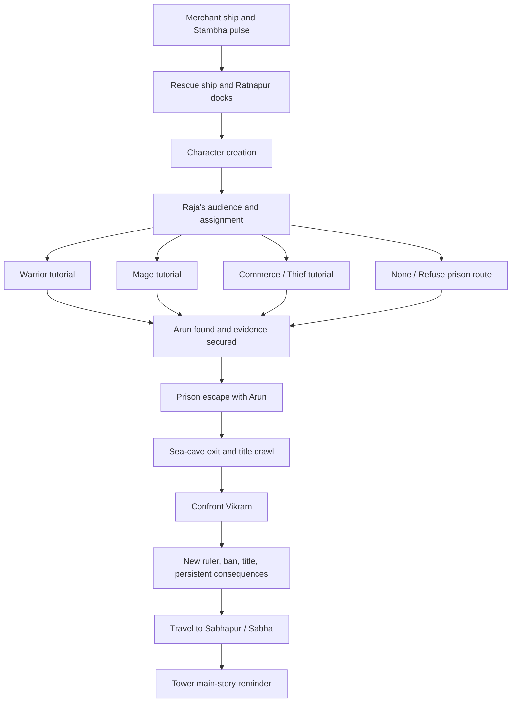

# Vertical slice plan — `storyline.md`, fully playable

**Audit date:** 2026-08-12 · **Retargeted to the vertical slice:** 2026-07-29

**Story authority:** `storyline.md` for Chapter 01 ·
[`Docs/STORY_ARC_INDIC.md`](Docs/STORY_ARC_INDIC.md) for the world premise and Chapters 02+ ·
[`Docs/JIVA_METAPHYSICS.md`](Docs/JIVA_METAPHYSICS.md) for all jiva/prana rules

**Gameplay flow authority:** [`Docs/GAMEPLAY_DESIGN.md`](Docs/GAMEPLAY_DESIGN.md) — navigation,
dialogue, travel, combat scope and the Stambha-as-HUD decision

**Picking this up cold?** Start at [`Docs/AGENT_HANDOFF.md`](Docs/AGENT_HANDOFF.md) — verification
commands, invariants, known traps and the ordered work packets.

**Target:** a vertical slice in which the complete authored opening chapter is playable end
to end — shipwreck, rescue, character creation, Raja's audience, all four tutorial routes,
the Yuvraj reveal, prison escape, cave-exit title crawl, confrontation and regime change,
Rajdoot title, and the Sabhapur / Sabha handoff. Content-complete, quality-reduced.
See “Vertical slice definition” for the cut-lines.

**Expected first-route length:** about 45–70 minutes before polish/playtest adjustment,
with substantial replay-only content in the other three routes.

**Studio:** DataTheCodie Studios · **Engine:** Unity 6000.5.3f1, URP 17.5 · **Platform:**
Windows player

**Current delivery status (2026-08-12):** the P1 runtime-flow defects, player-facing Ratna Bay
migration/content guard, one-page jiva contract and deterministic Arena Miniature street /
dungeon proof are complete. W-11 then delivered the standalone Ratna World Builder MVP with
one-button Unity preview and 14/14 Python tests. Shantipur's baseline highland city and road are
also present. The next world milestone is the full W-12 dense Ratnapur region rebuild; free-form
heightmaps, marker import, a real-controller walkthrough and 45+ FPS acceptance remain open.
VS1's technical spine and the four-route VS2 grey thread remain green.

> Historical completion notes below may retain old display names when quoting an earlier
> build or stable internal identifiers. Current player-facing names are Ratna Bay, Uttara,
> Maru, Ratnapur, Sabhapur, Marukot, Stambha, Dhruva Order, Siddha Order, Sabha and Rajdoot.

### Plain-English stage names

`VS` only means **Vertical Slice**. It is a stage number, not a feature or secret codename.

| Short name | Plain-English meaning |
|---|---|
| VS0 | Finish planning the story and dialogue |
| VS1 | Build the underlying save, scene, quest and dialogue systems |
| VS2 | Make the entire story playable in rough grey boxes |
| **Proof-slice gate** | Repair P1 flows, lock the setting/metaphysics and prove the Arena Miniature look |
| **Map Editor MVP** | External world-layout editor delivered after the proof-slice gate |
| VS3 | Replace the rough opening with the real shipwreck, rescue, creator and audience |
| VS4 | Build the reusable route mechanics: sailing, stealth, locks, pickpocketing and companion AI |
| VS5 | Build the four actual tutorial routes |
| VS6 | Build the Yuvraj reveal, prison escape and cave title moment |
| VS7 | Build the confrontation, new Raja and Sabhapur handoff |
| VS8 | Polish, test and package the complete chapter |

Other repeated planning terms:

- **Technical spine** = invisible foundations shared by every story scene.
- **Grey thread** = the whole story works from beginning to end, but uses plain rooms,
  placeholder text and simple actors.
- **Convergence** = all four routes meet when Yuvraj Arun is found.
- **Gate** = the test that must pass before moving to the next stage.
- **Stable id** = an internal computer label; players and world authors never need to see it.

## Scope lock

`storyline.md` is authoritative. This plan does not replace, condense, or redirect it.
The following are required content, not stretch goals:

1. Merchant ship voyage, Stambha sightline, Dhruva Order warships, pranic pulse, wreck, and water
   sequence.
2. Rescue ship, Ratnapur arrival, survivor processing, and real character creation.
3. Raja's audience and assignment by the player's declared inclination.
4. Four materially distinct routes:
   - Warrior: combat training, hunt/patrol, secret prisoner transport.
   - Mage: spell training, jiva-stone delivery, restricted prison accident.
   - Commerce/Thief: sailing, lockpicking, pickpocketing, sneaking, and secured tower.
   - None/Refuse: general prison, soul-harvesting reveal, and the deliberately fastest
     route.
5. Yuvraj discovery, explanation, route convergence, evidence, and joint escape.
6. A shared sea-cave exit used as the walking-into-the-world title-crawl moment.
7. Confrontation with Vikram, his removal, the successor, the prisoner jiva-binding
   ban, and persistent world-state changes.
8. The player's Rajdoot title and the mission to Sabhapur to seek recognition from the Sabha.
9. A final Stambha reminder that hands the player into the wider main story.

The Ratna Bay setting was adopted on 2026-08-12. `storyline.md` now carries current display
names. Technical ids remain stable and separate from display strings, so the migration does
not rewrite saves, quest logic or scene references.

## Verdict

The exact story is viable in this project, and a playable slice of all of it is a
reasonable next deliverable. The existing world and gameplay prototype are a useful
foundation, but the opening is a **multi-scene RPG chapter**, not a 15–20 minute demo. It
needs new narrative, interaction, traversal, save, AI, interior, cinematic, animation,
audio, and world-mutation work.

What makes the slice achievable is dropping the *finish* bar, not the story: greybox art,
placeholder audio, no voice acting, minimum animation. What makes it risky is that four
distinct routes must all reach one convergence contract. The plan front-loads that risk
into VS2 (the grey thread) so it is discovered in week three rather than month three.

Estimated readiness for the complete authored opening: **30–35%**. The playable grey thread
and reusable systems are substantially ahead of the authored screenplay, performances and
final environments, so this is not a content-completion percentage.

| Area | Readiness | Evidence |
|---|---:|---|
| Build and tooling | 90% | Windows build, asmdefs, compile checker, headless capture bridge and Ratna World Builder MVP |
| Exterior-world foundation | 65% | elevated land, four baseline walled cities, roads, docks, collision, map/travel; dense-region architecture pending |
| General gameplay prototype | 70% | movement, combat/equipment, five spells, inventory, NPCs, enemies, save/load |
| Story architecture | 55% | 42-beat grey thread, Bootstrap/additive scenes, topic dialogue, evidence and stable saves exist; authored screenplay/content remains |
| Route-specific mechanics | 55% | combat/magic, sailing, stealth, locks and pickpocket systems exist; authored route use remains |
| Interiors, cinematics, and actors | 30% | multi-room grey interiors, deterministic cinematics, billboard cast and Arena prison proof exist; performances/final spaces remain |
| Audio, animation, and final feel | 10–15% | SFX library and fonts exist; actors are static and there is no narrative mix |
| Story QA and shipping | 45% | full route/save-state automation exists; packaged full-play, performance and blind-playtest gates remain |

Planning ranges, assuming one focused developer using existing low-poly assets:

- **This vertical slice — every story beat playable, all four routes, greybox finish:**
  73–111 focused days. Broken down in the milestone table below.
- **Presentable low-poly release candidate:** a further 25–40 days on top of the slice,
  mostly art, animation and audio.
- **Fully voiced, bespoke cinematic quality:** a separate production tier measured in
  additional person-months.

These are planning ranges rather than promises. The milestone gates below keep the full
story intact while exposing technical or content problems early.

## Current goals — 2026-08-12

| Order | Goal | Current state | Exit condition |
|---:|---|---|---|
| 1 | **Close VS0** | Complete except screenplay, deliberately deferred to the VS2→VS3 content window | narrative contracts, regression baseline and asset ledger stay authoritative |
| 2 | **Build VS1** | **Complete: W-01–W-09 and consequence gate pass** | preserve the green technical-spine regression suite |
| 3 | **Prove VS2** | **Complete: four routes reach B830** | preserve the grey-thread route gate and stable scene contract |
| 4 | **Stabilise/migrate/prove Arena Miniature** | **Complete: P1 fixes, content guard, jiva contract, captures and automated checks** | keep the manual controller/45+ FPS acceptance debt visible |
| 5 | **Build Ratna World Builder MVP** | **Complete: one-button Unity preview; 14/14 Python tests** | preserve validation, backups, undo/redo and preview pipeline |
| 6 | **Add Shantipur baseline** | **Complete: `city_north`, highland footprint and connecting road** | preserve stable-id, dry-arrival, collision and road contracts |
| 7 | **Build W-12 dense Ratnapur region** | **Next world milestone** | one dense region proves cost, navigation and performance before wider propagation |
| 8 | **Replace the grey thread with content** | Not started | VS3–VS7 gates pass in order |
| 9 | **Package the slice** | Not started | VS8 route/outcome matrix, performance floor, second-machine build and blind playtests pass |

Immediate work is therefore documentation and architecture, not more free-roam POIs,
crafting, settlements or visual sprawl. Existing exploration systems stay working, but new
work must serve a Chapter 01 beat or a VS1/VS2 dependency.

## What is actually in the project

Verified in the repository and Unity Editor:

- 74 runtime scripts plus 18 editor scripts, plus the standalone Python world-authoring tool;
- persistent `Bootstrap`, generated legacy `Main`, additive `Capital_Exterior`, and 11
  regenerable Chapter 01 grey scenes, plus four small transition fixtures;
- a successful local Windows player (143.8 MB) booting through `Bootstrap`;
- release verification: 120/120 EditMode and 130/130 PlayMode passing on 2026-08-12,
  including scene-contract
  checks, the complete 42-beat VS2 union, typed outcome/evidence/autosave checks and all four
  routes reaching the Sabhapur handoff; the World Builder Python suite is 14/14 green;
- 5 NPC archetypes, 5 hostile spawns, 3 quests, and 9 discovery/travel markers;
- SaveGameV4 persists player stats, inventory, quests, discovery, scene/spawn, profile, route,
  evidence, companion, cinematics, equipment, skills, mutations and outcome state;
- one 6.8 km generated bay with ten continuous elevated landmasses, four baseline walled cities,
  five regional roads/causeways, and three islands;
- CC0 environment packs, OFL fonts, UI/combat SFX, and a Blender-generated seven-piece
  desert architecture kit;
- regenerable Player, GameSystems, NPC and full HUD visual prefabs, plus five NPC archetype
  ScriptableObjects. Animator controllers/clips, authored story interiors, profiler captures,
  ambient beds, music, and implemented authored story content remain absent. One
  keyboard/mouse `.inputactions` asset owns every current binding.

`storyline.md` now supplies the narrative outline. VS2 has a playable grey implementation:
placeholder geometry, an in-game Raja's audience assignment panel, all 42 beat milestones,
evidence, companion, typed outcome state and route autosaves all run through B830. Authored
screenplay, actors, mechanics and final environments remain VS3–VS7 work.

## Completed hardening

### Earlier pass

- Added `WorldLayout` as the shared source for geography and travel sites.
- Added explicit gameplay layers and layer-masked interaction/combat.
- Fixed all NPCs and enemies spawning in one pile.
- Moved two POIs out of open water and corrected road placement.
- Replaced 639 per-prop foliage updates with one culling system.
- Added asmdefs, `Tools/compile-check.py`, headless build tooling, and 9 EditMode tests.
- Reduced the Windows build from roughly 206 MB to 140 MB with a texture budget.
- Added the deterministic Blender Sarrakh kit generator.

### Audit repair pass — 2026-07-26

- **Save integrity:** removed the unconditional startup autosave that overwrote the only
  save slot; added a title-screen Continue path.
- **World-state restore:** loading now removes enemies killed in the save and respawns
  enemies that were killed after that save.
- **Economy:** merchants now charge gold before granting a potion.
- **Weather:** regional weather updates against the destination/current region before a
  reroll.
- **Map:** the player marker is no longer reused and destroyed as the first location marker.
- **Spawn/travel:** player spawn, fast travel, and rescue place the CharacterController
  feet on the ground with a small clearance instead of dropping the player by about 1 m.
- **First-person camera:** the Player layer is excluded, preventing the camera from
  rendering the player body from inside the head.
- **World geometry:** fixed the Corrath tower inheriting a huge island-top scale.
- **Prototype artifacts:** removed generated city, POI, enemy, and NPC world-space
  nameplates that appeared mirrored from behind.
- **Cutscene:** authored actor scale is preserved and actors are always cleaned up after
  completion or skip.
- **Foliage:** culling follows the actively rendering camera during the intro and gameplay.
- **Dialogue/input:** dialogue now blocks gameplay, pauses safely, closes explicitly, and
  uses realtime timeout; menus consistently own pause and cursor state.
- **Presentation:** rebuilt the HUD and title menu with translucent charcoal, silver,
  muted bronze, Cinzel, and EB Garamond — restrained hierarchy built from original and
  licensed assets.
- **Rendering:** switched to Linear color, repaired the broken VolumeProfile sub-assets,
  enabled camera post-processing, set 4× MSAA, four shadow cascades, and a 220 m shadow
  distance, and removed double-applied terrain texture tiling.
- **Generator safety:** presentation rebuilds no longer delete and recreate copied
  Resources assets, so their GUIDs stay stable.
- **Compiler health:** removed current Unity API obsolescence warnings in touched paths.

### World-depth repair pass — 2026-07-27

- **Continuous geography:** replaced rectangular terrain patches with closed elliptical
  meshes and subdivided coast strips. Shorelines now follow the same geometry in the
  world, travel checks, and map art instead of exposing triangular gaps.
- **Elevation:** added deterministic biome-aware ridged terrain with dry interior
  guarantees, higher Karnoth/Kiln profiles, and flat city build zones blended
  into their surroundings.
- **City collision:** replaced hundreds of mis-selected microscopic roof modules with
  134 bounded procedural buildings. Every non-enterable building has exactly one
  enabled `BoxCollider`; decorative roofs and foundations have none.
- **Walls and gates:** built 160 overlapping wall segments across the three cities,
  all with simple box collision, measured cardinal gate openings, gate towers/lintels,
  and terrain-matched approach ramps.
- **Waterfronts:** moved piers and quays from elevated grass to the waterline and added
  collider-backed causeways from each city pad. Decorative ships are normalized,
  offshore, and collider-free.
- **Regional structure:** added Kelrith–Karnoth, Qadris–Sarrakh Waste, and
  Sarrakh Waste–Kiln routes, widened roads, added guarded causeway rails, and concentrated
  modest dressing along playable routes.
- **Asset curation:** building, tower, dock, tree, prop, camp, and ruin pools are now
  deterministic and role-filtered. The `roof-corner-inner`/`Contains("inn")` bug is
  removed.
- **Save compatibility:** old saves keep their X/Z location but reconcile Y to the new
  terrain when submerged or materially displaced.
- **Rendering:** generated/runtime materials opt into GPU instancing where supported;
  terrain is static, while mesh collision is reserved for the ten terrain surfaces.
- **Title audio:** the overlay-only title now keeps one audio listener active without
  enabling a rendering camera, eliminating the startup listener warning.

## Current validation

- `python Tools/compile-check.py` rerun 2026-08-01: Editor (14 files), Runtime (50 files),
  PlayMode (9 files), and EditMode Tests (5 files) assemblies pass.
- Unity console after regeneration and title startup: **0 project errors, 0 project
  warnings**.
- Unity EditMode rerun 2026-08-01: **45 passed, 0 failed**.
- Unity **PlayMode** 2026-08-01: **30 passed, 0 failed**, exit code 0. Scene tests prove
  additive travel and rollback; state tests prove pause/cursor/input policy, exact restoration
  after temporary loading, and protection against mismatched state releases.
- `McpBootstrap` no longer starts the MCP bridge in batch mode. It retried 60 times against a
  server that cannot exist headlessly, and the package's connection errors failed whichever
  test fixture was active — the suite was non-deterministic before this was found.
- Live title, Continue, first-person Game view, city entrance, and coastline inspected
  after scene regeneration.
- Scene audit: **2,042 GameObjects, 1,797 renderers, 905 colliders**; 894 are box
  colliders and the only 10 mesh colliders are the terrain surfaces.
- Geometry audit: **0 invalid terrain indices, 0 fake roof-corner buildings, 0 building
  collider violations, 0 wall collider violations, and 0 approach collider violations**.
- Physics probes: representative wall and building rays hit their box colliders; the
  south gate walking ray remains clear; every city has five collider-backed approaches.
- Current Windows x64 build **2026-08-14: `Builds/Windows/RatnaBay.exe`, 145.2 MB, 0 errors**,
  built headlessly in 24.7s via `BuildPlayerCommand.BuildWindows`, with `Bootstrap` as scene
  zero. This replaces the stale
  pre-rename `IliacBay.exe`, which still sits beside it in the (gitignored) build folder and
  can be deleted.
- The packaged player launches to the title screen with **0 exceptions or managed errors in
  `Player.log`**. Driving it *through* gameplay is still manual; the New Game, Continue and
  Return-to-Menu paths are now covered automatically in-editor instead.
- Volume inspection confirms Color Adjustments, Vignette, and Bloom are real referenced
  components rather than null profile entries.

**The VS0 regression baseline is complete as of 2026-08-01.** Save rollback, menu flow, boot,
fast travel, dialogue pause, death recovery and merchant economy are now covered
automatically, and a current packaged build exists.

What the tests still do **not** prove: combat depth beyond the merchant/economy path, authored
dialogue and environments, route mechanics beyond grey traversal, and packaged-player behaviour
past the title screen. VS1's systems and VS2's 42-beat grey thread now cover the technical
contracts; those remaining gaps are VS3–VS8 content and polish.

## Remaining issues and risks

### P0 — required before building story scenes

*Delivered by VS0 and VS1. Nothing in the slice plan starts authoring until these are done.*

- [x] Decompose `storyline.md` into 42 stable beats with owning scenes, system
  dependencies, exit states and acceptance tests in `Docs/CHAPTER01_BEATS.md`.
- [x] Lock the continuity contract shared by all routes:
  - Arun's location and condition at each stage;
  - which route-specific evidence enters the shared evidence inventory;
  - how each route reaches the same prison checkpoint without contradicting another;
  - how Arun and the player reach the sea cave;
  - the cave exit as the title-crawl checkpoint;
  - how they safely return to confront Vikram after the title moment.
- [x] Lock the outcome scope: the player chooses kill or imprison, Arun succeeds,
  and the player becomes Rajdoot.
- [x] Lock the character-creation production ceiling: 3–4 ancestries using one shared body
  and rig.
- [ ] Finish the Chapter 01 screenplay and dialogue against the beat ids. **Unblocked as of
  2026-08-01** — both narrative locks that gated it are closed.
- [x] Name and characterize the principal cast, and define the four ancestries and their
  origins. House Selwyn, six named recurring roles, four regional ancestries. Only ancestry
  *starting values* remain, and they are a VS3 item.
- [x] Resolve why the rescue ship chooses Ratnapur and why the survivors receive a royal
  audience. **The rescue ship is the Raja's own**, searching the Yuvraj's route; one premise
  answers both.
- [x] Define the Stambha pulse rules before VS3 authors the wreck and memory responses.
  **Cause deferred to later chapters; effect authored** — memory disruption for everyone who
  was on the water.
- [x] Specify the speed route as intentional content. Target time **15 minutes**; mandatory
  information is B510's split reveal, skips are permitted but the reveal is repeatable, and
  `ev.prisoner_testimony` is the required state flag. Failure and gear rules are now locked for
  all four routes in `Docs/CHAPTER01_BEATS.md`.
- [x] Separate stable internal ids from display strings in world and story documentation.
- [x] Add PlayMode smoke tests for New Game, Continue, save → kill → load rollback, merchant
  purchase, fast travel, dialogue pause, death/rescue, and return to menu. **Done 2026-08-01:**
  `Game.PlayModeTests`; the suite is now **29/29 green**. All eight original categories are
  covered, plus SaveGameV4 migration/atomicity, story/dialogue/cinematic contracts,
  additive A→B→C travel, transactional rollback and the W-09 consequence gate. New Game,
  Continue and Return-to-Menu still drive the real generated `Main` flow.
- [x] Produce a current Ratna Bay Windows build and repeat the packaged launch smoke.
  **Updated 2026-08-01 after VS1:** `Builds/Windows/Kessil.exe`, 142.1 MB, 0 errors,
  built headlessly in 38.3s with Bootstrap as scene zero. The packaged player initializes
  with **0 exceptions in its smoke log**.
  Driving the packaged build *through* gameplay remains a manual step — but the flows it used
  to be the only evidence for are now covered automatically in-editor.
- [x] Create an asset ledger with source URL, version, license, proof/date, and whether source
  redistribution is allowed. [`Docs/ASSET_LEDGER.md`](Docs/ASSET_LEDGER.md) — everything is CC0
  except OFL fonts. Four missing licence files and unrecorded download dates are the only gaps.

### P1 — architecture and gameplay debt

- [x] Add persistent `Bootstrap`, additive loading, stable spawn ids, fade/rollback, and an
  exterior snapshot while keeping destructive `Main` regeneration safe. **W-01 complete
  2026-08-01.** `Main` remains the temporary legacy gameplay container until story scenes
  replace it during VS2/VS3.
- [x] Replace code-built player, friendly-NPC, systems and UI roots with regenerable prefabs;
  move friendly NPC definitions into ScriptableObject data. **W-04 complete 2026-08-01.**
- [x] Add one Input System actions asset for the slice's keyboard/mouse bindings. **W-03
  complete 2026-08-01:** all runtime consumers use `GameInput`; direct device polling is
  gone. Controller support remains explicitly outside slice scope.
- [x] Replace scattered pause, cursor and gameplay-input checks with one `GameStateService`.
  **W-02 complete 2026-08-01.** It owns menu, cinematic, gameplay, dialogue, loading and
  death modes, including nested loading rollback.
- [x] Replace random line pools and auto-active quests with conditional dialogue, explicit
  quest stages, story flags, route gates, evidence requirements, and consequences.
- [x] Add generic interaction, doors, locks, readable evidence, item use, stealth/detection,
  crouching, pickpocketing, sailing, follower/escort, scene transition, and world-mutation
  systems. Combat and magic expose tutorial-state hooks rather than special-case scene code.
- [x] Add character profiles and route assignment. Character appearance persists across
  every scene and save.
- [x] Upgrade the save format to include current scene/spawn, character profile, story chapter
  and stage, flags, route, evidence, dialogue choices, companion state, Vikram outcome,
  ruler state, granted title, opened locks, looted objects, and skipped cinematics.
- [x] Version the new save schema and migrate, preserve as legacy sandbox, or safely reject
  current v3 prototype saves.
- [x] The legacy prototype was already schema v3. The story-aware format is therefore
  be **v4**, not v3; otherwise old stat/world saves could be accepted without route or
  chapter state.
- [x] Continue validates the header before entering gameplay; old-version/corrupt saves are
  rejected safely.
- Add PlayMode coverage for generated city collision, gate clearance, harbor causeways,
  and save-height migration; current geometry checks are editor inspection/probes.

**P1 full-flow repair complete 2026-08-12.** Duplicate persistent `GameSystems` roots are
replaced immediately; Return to Title → second New Game is covered; Continue waits for load
and story restoration; Capital Region death respawns in-region; interior exits apply the
remembered doorway only after transition; city density branches on stable ids; and learned
topics save/restore with deterministic response selection and pagination beyond nine topics.

### P1 — world and performance debt

- The islands and cross-bay travel are still fast-travel only; add a deliberate ferry or
  controlled transition rather than encouraging a long swim.
- The world is now elevated and connected locally, but the 6.8 km footprint remains
  sparsely dressed beyond cities, POIs, and regional routes.
- The current cities are readable, collidable exterior shells, not authored hero spaces:
  buildings have no doors/interiors, walls have no battlements or climb routes, and there
  is no navmesh.
- Ratnapur specifically needs a survivor-processing dock, functioning palace/throne room,
  guard yard, Siddha Order hall, working harbor, secured tower, layered prison, black-jiva
  chamber, escape route, and sea cave. Sabhapur needs at least a convincing arrival and
  Sabha handoff space for this chapter.
- The story needs reliable crowd and companion navigation. Bake or build navigation per
  authored scene, add off-mesh links only where tested, and keep large decorative areas
  outside active simulation.
- About 2,042 GameObjects, 1,797 renderers, and 905 colliders are present. Mesh collision
  has been reduced to 10 terrain surfaces and instancing is enabled where supported, but
  there is still no measured LOD, occlusion, batching, frame-time, or memory budget.
- Enemies use simple direct pursuit rather than navigation.
- Weather is functional but not production quality: rain does not wet surfaces and there
  is no thunder/ambient mix.
- The current player/NPC models have no authored animation, hit reaction, block, stagger,
  or death presentation.

### Shipping and legal debt

- Remove MCP/editor runtime payloads and `BurstDebugInformation_DoNotShip` from release
  packaging.
- Add application icon, credits/about, accessibility settings, quality presets, and input
  rebinding.
- Add a project code license and complete third-party notices.
- Before any public distribution, perform the final IP/rights review. The setting rename
  is done; what remains is the repository directory, the `.sln`, and a review of art,
  audio and font provenance.
- Test a clean zip on a second machine.

## Story flow contract

The four branches may vary in length, mechanics, information order, and evidence, but
they must enter the convergence checkpoint with a valid Arun state, evidence set, companion
state, and story stage. No route may rely on another route having happened.

## Scene and loading architecture

Use one persistent scene and authored additive scenes. Do not keep expanding the generated
`Main` scene.

| Scene | Purpose | Required exit state |
|---|---|---|
| `Bootstrap` | persistent services, input, UI, audio, saves, loading | services initialized once |
| `Prologue_Ship` | voyage, Tower/warships, pulse, wreck, water | player marked rescued |
| `Docks` | rescue arrival, processing, character creator | valid character profile |
| `Palace` | first audience, questioning, assignment | one route locked |
| `Capital_Exterior` | current exterior extracted from `Main` | safe regional traversal |
| `Tutorial_Warrior` | training and hunt/patrol | Arun/evidence convergence payload |
| `Order_Hall` | spell training and delivery setup | access to restricted prison |
| `Harbor` | sailing and thief instruction | tower objective complete |
| `Secured_Tower` | infiltration objective | evidence/Arun route transition |
| `Prison` | general cells, solitary, black-jiva operation, convergence | Arun follows player |
| `Sea_Cave` | shared escape and title-crawl vista | prologue escape complete |
| `Palace_Aftermath` | confrontation and outcome | ruler/title/world mutation saved |
| `Council_Arrival` | Council mission handoff and Tower reminder | opening chapter complete |

Reuse an authored scene for multiple states when safe; use world-state variants rather
than duplicating whole environments. Every transition needs a spawn ID, fade/load
contract, autosave policy, companion handoff, and recovery path if loading fails.

## Required data and systems

| System/data | Minimum responsibility |
|---|---|
| `CharacterProfile` | name, race, appearance recipe, pronouns, background, declared inclination |
| `StoryState` | chapter, stage, selected route, flags, choices, outcome, title |
| `StoryDirector` | sole authority for beat transitions, idempotent actions, checkpoints, and route convergence |
| `QuestDefinition` / `QuestStage` | objectives, conditions, transitions, failure/recovery, map markers |
| `DialogueGraph` | **topic-based, not tree-based** — keyword hypertext with conditional responses, choices, effects, subtitles, speaker/camera cues. See `Docs/GAMEPLAY_DESIGN.md`; this is the one delta with a VS1 deadline |
| `EvidenceRecord` | source route, inspected state, legal weight, confrontation availability, **full readable document body** — evidence is shown, never summarised into a journal line |
| `Interactable` | inspect, talk, loot, use, open, lockpick, pickpocket, activate, board |
| `DoorAndLock` | keys, difficulty, lock state, animation, crime/noise response |
| `DetectionSystem` | sight, hearing, suspicion, alert, concealment, route tutorial feedback |
| `PickpocketSystem` | target inventory, chance/skill rule, detection, consequence |
| `SailingController` | board, steer, throttle, disembark, reset, objective corridor |
| `CompanionController` | Arun follow/wait/teleport recovery, combat policy, scene handoff. **Authored sequences only** — no open-world travel companions, so it never has to survive ferries, private sailing or arbitrary world save/load |
| `WorldMutation` | Raja/ruler swap, guards/dialogue, prison policy, banners, blocked/open areas |
| `GameState` | gameplay, dialogue, cinematic, menu, loading, death; input/cursor/time ownership |
| `SceneTransitionService` | additive load order, spawn placement, companion handoff, fade, failure recovery |
| `CinematicRunner` | deterministic cues plus an idempotent end-state applied when watched or skipped |
| `Equipment` | weapon and armour slots with stats on `InvItem`; `PlayerCombat` reads the equipped weapon instead of a hardcoded field |
| `SkillSystem` | eight use-based skills; `Level` derives from total skill progress; the five anti-grind rules in `Docs/GAMEPLAY_DESIGN.md` |
| retained `CrystalCharge` API | Prana is non-regenerating charge drawn from jiva stones—the setting's scarcity made playable |
| `SaveGameV4` | atomic write/backup, profile plus all story/system state, scene/spawn, versioning, safe v3 handling, **plus skills and equipped set** |

Author content in ScriptableObjects or another inspectable data format; keep logic in
reusable runtime systems. Dialogue, quest stages, and cutscene cues must not be buried in
one-off scene scripts.

## Vertical slice definition

**The deliverable is one build in which `storyline.md` plays from the first frame to the
Sabhapur handoff, on all four routes, with no missing beats and no developer
intervention.**

This is a *content-complete, quality-reduced* slice rather than the classic
narrow-but-final-quality kind. The story is not cut; the finish is. A beat that only works
if someone explains it, or that needs the editor to get past, is not in the slice.

### In the slice

- Every beat in `storyline.md`, in authored order, reachable and completable.
- All four routes playable and **mechanically distinct** — each teaches what the story says
  it teaches.
- Character creation that persists into every later scene and save.
- Save and load anywhere in the chapter, including mid-route and mid-escape.
- Watching or skipping any cinematic produces identical story state.
- Greybox-to-low-poly art built from the existing kits and the Blender generators.
- Library/placeholder audio with a real mix layout; subtitles on every line.
- Keyboard and mouse; one supported resolution family; Windows player.

### Deliberately not in the slice

Deferred to a later production tier, and listed here so they are not smuggled in:

- Voice acting. Silent protagonist, subtitles only. Generated cutscene voice is planned for
  the release-candidate tier; the slice builds the audio hooks and ships silent, because what
  the slice must prove is the cutscene state contract, not its performance. **The protagonist
  is silent permanently** — that is what keeps topic dialogue affordable.
- Conjuration, summons, and open-world travel companions. Cut outright, not deferred; see
  `Docs/GAMEPLAY_DESIGN.md`.
- Diving and underwater content. Swimming is surface-only and deliberately slow.
- Animation beyond a minimum set: locomotion, attack, block, hit, cast, death, and the
  handful of story-critical performances (imprisonment, Vikram's removal).
- Final art, lighting and material passes; interiors beyond what a beat requires; world
  density outside the critical path.
- Controller support, localization, and accessibility beyond subtitle size and volume.
- The existing free-roam sandbox (bandit camp, coastal ruin, radiant quests). It stays
  working but is **parked** — do not extend it during the slice.
- Performance work beyond holding the chosen floor at the five stress locations.

### The cut-line rule

When a beat runs long, reduce its *finish*, never its *presence*. A prison corridor may be
three grey rooms; it may not be a fade-to-black with a caption. The one exception is
crowd scale: named speaking roles are required, background populations are not.

## Vertical slice plan

Nine milestones. Each has a gate that must be green before the next starts, because every
later milestone depends on the state contract the previous one froze.

Planning range for the whole slice: **73–111 focused days** for one developer using the
existing kits. The grey thread (VS2) is the milestone that converts this plan from
speculation into a measurable burn-down, and it should land inside the first three weeks.

### VS0 — story production package and regression baseline (4–6 days)

- ✅ **Done 2026-07-29** — [`Docs/CHAPTER01_BEATS.md`](Docs/CHAPTER01_BEATS.md): 42 beats
  with stable ids, owning scenes, system dependencies, exit states and acceptance tests,
  plus the route/flag/evidence/cast registries, the convergence contract and the outcome
  matrix.
- Break `storyline.md` into numbered beats with ids, objectives, dialogue, choices and
  transition conditions. This is transcription and decomposition, not rewriting.
- Write the screenplay pass for every scene: ship, rescue, processing, both audiences,
  four tutorials, the Yuvraj reveal, prisoner exposition, escape, confrontation,
  succession, title grant, Sabhapur handoff.
- Build the route/outcome matrix and the stable id registry (ids follow the naming policy:
  setting-neutral, never a display name).
- Record the shared convergence payload and the cave-exit title placement as hard
  contracts — these are what keep four routes from diverging into four games.
- Snapshot current build, test, scene and save behaviour as the regression baseline.
- Resolve the narrative locks that block authoring: Vikram outcome, successor, player title,
  supported character options. See the locks list below.

**Gate:** every sentence in `storyline.md` maps to at least one beat id, owning scene,
system task and acceptance test. Existing prototype behaviour stays green.

### VS1 — persistent technical spine (8–12 days)

Build the systems the story sits on, before any story content exists.

- [x] `Bootstrap` scene, additive loading, spawn ids, transitions, fades, loading overlay,
  and a recovery path when a load fails. **W-01 complete 2026-08-01.** Three real fixture
  scenes pass in sequence and both missing-scene and missing-context rollback are tested.
- [x] `GameStateService` as the single owner of input permission, cursor, time scale and
  pause. **W-02 complete 2026-08-01.** Flow, HUD, transitions, movement, combat, interaction
  and death now consume the shared state.
- [x] One Input System actions asset, with typed `GameInput` access and no direct keyboard or
  mouse polling. **W-03 complete 2026-08-01.** Keyboard/mouse only per the scope lock.
- [x] Prefabbed player, NPC, systems and complete HUD visual hierarchy; no runtime
  `AddComponent` construction for those roots. **W-04 complete 2026-08-01:** secondary
  `MonoBehaviour` classes now live in matching files; generated Main preserves real Player
  and GameSystems prefab links; five rename-safe NPC archetype ScriptableObjects hold
  placement, appearance, dialogue and role data.
- [x] Data-driven quest stages, topic-based conditional dialogue, story flags, route gates,
  dialogue choices and readable full-document evidence records. **W-06/W-07 complete
  2026-08-01.**
- [x] `CharacterProfile` and `SaveGameV4`: scene/spawn, profile, chapter, stage, route,
  flags, evidence, companion, mutations, outcomes, cinematics, skills and equipment; atomic
  backup, menu validation, injectable test paths and safe v3 migration. **W-05 complete
  2026-08-01.**
- [x] `CinematicRunner` with deterministic cues and an idempotent end-state applied whether
  watched or skipped. **W-08 complete 2026-08-01.**
- [x] Extract the current exterior geography into regenerable `Capital_Exterior` without
  destroying the working world.
- [x] Move global dimensions, anchors, landmasses, sites and roads into versioned
  `Assets/Resources/Data/World/kessil.world.json`; runtime generation and all prior geometry
  contracts consume it without changing the current map. **VS1 JSON plumbing complete
  2026-08-01.**

**Gate: passed 2026-08-01.** The W-09 consequence proof crosses three additive scenes,
branches, takes readable evidence, saves, simulates quit/continue, returns to the saved
scene/spawn, restores its companion and mutations, and rolls post-save changes back.

### VS2 — the grey thread (6–9 days) — **complete 2026-08-01**

**The de-risking milestone.** Make the entire chapter traversable before making any of it
good.

- Every scene in the scene table exists, even if it is a grey box with a placeholder sign.
- Every transition between beats works, in order, with the real spawn and autosave
  contract.
- All four routes are selectable at the audience and lead to the convergence checkpoint —
  stubbed, but genuinely separate paths, not one path with a flag.
- Every cinematic is a timed placeholder card that applies its real end-state.
- Dialogue is placeholder text driven by the real dialogue graph.

**Delivered:** 11 regenerable Chapter 01 grey scenes plus the extracted `Capital_Exterior`
scene are enabled in build settings. Each grey scene has a stable `SceneContext`, named
spawns, stone walls, a gate, stepped elevations, lights and collision-backed geometry. The
`GreyThreadDirector` drives all **42/42** beat waypoints: prologue, the real Raja's audience
assignment panel, four genuinely different route branches, prison/cave convergence, the
B640 title crawl, aftermath and Sabhapur Sabha handoff. The assignment panel records the
player name and inclination with keyboard/mouse-accessible buttons; a player is preserved in
persistent Bootstrap while old content scenes unload, fixing the first-scene transition
destruction bug. Route checkpoints use SaveGameV4, and typed Vikram outcome, ruler, title and
evidence state are captured for the next slice.

**Evidence:** 45/45 EditMode, 30/30 PlayMode; the PlayMode gate asserts the union of all 42
beat ids across the four routes, B640 title state, Arun's testimony, typed outcomes and valid
autosaves. Representative captures are in
legacy-named captures [`Docs/Screenshots/vs2-estmere-palace.png`](Docs/Screenshots/vs2-estmere-palace.png)
(Ratnapur) and [`Docs/Screenshots/vs2-caldemar-arrival.png`](Docs/Screenshots/vs2-caldemar-arrival.png)
(Sabhapur).

**Gate passed:** a developer can start a new game and reach the Sabhapur handoff on **all four
routes** without touching the editor. Total playtime is short and it looks intentionally
grey; every later milestone now replaces placeholder content inside a proven structure.

### VS3 — opening: voyage, pulse, wreck, rescue, creator, audience (8–12 days)

- Traversable merchant-ship deck, passengers and crew, with a constrained sightline to the
  Stambha and the Dhruva Order warships.
- The pulse staged with lighting, VFX, audio, camera impulse, a damaged ship variant,
  controlled physics, water entry and blackout. Tightly directed is fine; every described
  visual beat must appear.
- Rescue ship, Ratnapur arrival, and the survivor-processing dock.
- Character creation: preview, validation, random/default options, profile persistence,
  keyboard navigation.
- Raja Vikram's audience: the “every soul must contribute” edict, the questioning about the
  missing Yuvraj, the remembered/vague/no-memory responses, skill declaration, and four
  valid assignments. The edict foreshadows the prison operation without revealing it.

**Gate:** New Game reaches each of the four assignments with no broken camera, lost
profile, invalid save, sequence skip or contradictory quest state. Skipping the cinematics
lands on exactly the same flags as watching them.

### VS4 — route mechanics toolkit (7–11 days)

Build every route-specific mechanic **once**, as a shared system, before authoring the
routes that use them. Authoring four routes against four bespoke implementations is the
main way this slice fails.

- Tutorial prompt and objective framework, checkpoints, recoverable fail states.
- Combat and magic tutorial-state hooks on the existing systems.
- `DetectionSystem`: sight, hearing, suspicion, alert, concealment, crouch.
- `DoorAndLock` and lockpicking; `PickpocketSystem`; crime and alert response.
- `SailingController`: board, steer, disembark, reset, objective corridor.
- `CompanionController`: follow, wait, teleport recovery, combat policy, scene handoff.
- Telemetry on each, so route balancing later uses observed completion and failure data.

**Gate:** each mechanic is demonstrable in an isolated test scene, survives save/load, and
cannot strand the player. Sailing and stealth are proven here because they are the two
largest unknowns in the whole slice.

### VS5 — the four routes, authored to convergence (12–20 days)

The largest milestone. Each route replaces its VS2 stub with real content.

- **Warrior** — guard-yard instruction (movement, melee, block, hit feedback, safe spar),
  hunt/patrol with encounter pacing, the secret prisoner transport, and the wounded-Arun
  discovery.
- **Mage** — spell instruction with cast/resource/target feedback, a nonlethal practice
  space, the jiva-stone delivery, restricted-access rules, and the staged accident that
  opens the sealed cell.
- **Commerce / Thief** — the bounded sailing lesson, sneaking and detection, pickpocketing,
  lockpicking, crime response with non-blocking retries, and the secured-tower
  infiltration connected spatially to the prison.
- **None / Refuse** — immediate arrest, general population, prisoner conversations that
  reveal the soul operation without one unskippable exposition dump, and a short
  intentional route to solitary. Measured against a target completion time.

Each route delivers its own evidence into the shared evidence set and enters convergence
with a valid Arun state, companion state and story stage.

**Gate:** four clean-save end-to-end runs reach an identical convergence contract. The None
route is measurably fastest. No route relies on another having happened. Failure, death,
save/load and sequence breaks cannot strand progression.

### VS6 — prison, Yuvraj, escape, and the title moment (8–12 days)

- Prison layout: public cells, restricted wing, solitary, processing, evidence room, the
  soul-binding operation, guard routes and escape connections.
- Arun's explanation: his alternative, the interception, the imprisonment, his
  father's motive, and the Stambha/Dhruva Order seed.
- Route-specific discovery dialogue over one canonical reveal.
- Escort behaviour, guard alerts, alternate traversal, checkpoints, stuck recovery.
- The sea-cave exit composed as one tested sequence: exterior reveal, music swell, title
  card, subtitle timing, input hand-back, autosave.

**Gate:** every route escorts Arun from discovery to cave exit. Watching or skipping
produces identical required state. The title card appears exactly once, at the authored
cave checkpoint.

### VS7 — confrontation, succession, and the handoff (10–14 days)

- The return and confrontation path, including why the evidence can be presented rather
  than the player simply being rearrested.
- Evidence presentation, Arun's testimony, Vikram's defence, player response, and the
  authored outcome.
- World mutation: successor on the throne, throne-room population swap, guard and faction
  reactions, prisoner release, the operation outlawed, doors opened and closed, updated
  dialogue, journal and banners.
- The granted title, persisted and shown consistently in dialogue, journal and save
  metadata.
- Safe defaults for conflicting or missing flags, so a development save cannot produce two
  rulers or none.
- The Sabha quest, gated on a valid aftermath state, and a Sabhapur arrival that is
  a real space rather than a map marker. The chapter ends on the Stambha reminder and a
  clear next objective.

**Gate:** every route and supported outcome reaches one valid post-coup world. Save,
reload, death, fast travel and scene re-entry all preserve ruler, law, NPC set, title and
quest stage. A blind player can state who rules Ratnapur, what changed, why their title
matters, and why the Stambha matters.

### VS8 — POC assessment (3–5 days) · rescoped 2026-08-01

**Chapter 01 is an internal proof of concept**, built to prove the pipeline and teach the
process, not to be sold. The full hardening pass below is therefore **deferred to the real
release**, at the end of all eight chapters, and VS8 shrinks to what is needed to *judge* the
POC.

What VS8 keeps:

- The four-route and eight-outcome matrix, run for **structural validity** — no progression
  blockers, no save corruption, every beat present. This still matters; it is what the POC is
  proving.
- Enough readability on the critical path to answer the real question: **does this feel like
  the game described in the art direction lock?**
- A packaged build that launches and completes, so the pipeline itself is proven end to end.

What VS8 defers to the release tier: the narrative audio mix, the UI pass at multiple aspect
ratios, performance profiling against a frame-time floor, editor/debug payload removal,
notices and credits, second-machine validation, and blind playtesting.

Roughly ten days come out of the slice estimate. They are not deleted — they happen once, for
the whole game, rather than now for one chapter.

The full hardening scope, retained for the release tier

### Release hardening and packaged build (10–15 days, deferred)

- Run the QA matrix below on clean saves and on upgraded development saves.
- Bring the critical path to the readability bar: silhouettes, entrances, lighting,
  navigation, and the minimum animation set. Not a final art pass — the test is whether a
  stranger can navigate it without commentary.
- Lay in the narrative audio mix: bay, ship, storm, docks, city, palace, guild, prison,
  cave, confrontation, Sabhapur. Footsteps, Foley, UI, impacts, music transitions.
- UI pass on creator, dialogue choices, tutorial prompts, evidence, journal, title card and
  save/load at common aspect ratios.
- Profile the five stress locations; hold the chosen frame-time and memory floor.
- Remove editor/debug payloads, complete notices and credits, build a clean zip, validate
  it on a second machine.
- Blind playtest every route, with the None path tested separately as a speed route.

**Gate:** no progression blockers or save corruption across the full matrix. Build and
console clean. Every beat in `storyline.md` present. The packaged game completes on a
machine with no editor and no developer present.

### Milestone summary

| Milestone | Focus | Days |
|---|---|---:|
| VS0 | Story package, ids, locks, baseline | 4–6 |
| VS1 | Technical spine | 8–12 |
| **VS2** | **Grey thread — whole chapter traversable** | **6–9** |
| VS3 | Opening through first audience | 8–12 |
| VS4 | Route mechanics toolkit | 7–11 |
| VS5 | Four routes to convergence | 12–20 |
| VS6 | Prison, escape, title moment | 8–12 |
| VS7 | Confrontation, succession, handoff | 10–14 |
| VS8 | **POC assessment** (rescoped 2026-08-01) | 3–5 |
| | **Total** | **63–101** |

Chapter 01 is an internal POC, so VS8 shrank from 10–15 days to 3–5. The deferred release
hardening happens once for the whole game rather than now for one chapter.

These are planning ranges, not commitments. The two ranges most likely to move are VS5
(four routes) and VS4 (sailing and stealth, the least-proven mechanics). If the slice has
to shrink, it shrinks by reducing route *depth* — never by removing a route, because
`storyline.md` requires all four.

## World architecture — regions, not one bay · decided 2026-08-01

**The reference is Witcher 3's regions, not Morrowind's continuous landmass.** A city plus a
dense, walkable hinterland, authored as one plane, with the ferry network connecting planes.

This supersedes the continuous 6.8 km bay. The bay was correct for a continuous world and is
wrong twice over for this one: too large to fill at the required density, and connected in the
wrong way.

| Region | Contains | First needed by |
|---|---|---|
| **Ratnapur** | city, docks, palace, prison, Siddha Order hall, harbour, secured tower, sea cave, hinterland | **Chapter 01—all of it** |
| Sabhapur | Sabha seat, city, hinterland | Chapter 02. Chapter 01 needs only an **arrival sliver**, not the plane |
| Marukot | arid city, the settlement that went dark, hinterland | Marukot spoke |
| Shantipur | highland city, hinterland | Shantipur spoke; baseline city/road exists, dense region does not |
| Meru | the Stambha—a small special location, not a full plane | Chapter 06 |

### Region dimensions — locked 2026-08-01

Derived from a **7–8 minute walk across a city, north–south**, at the corrected 3.5 m/s walk
speed. Full derivation in [`Docs/GAMEPLAY_DESIGN.md`](Docs/GAMEPLAY_DESIGN.md) §
*Traversal and scale*.

| | Size |
|---|---|
| City core | ~1.2 km across |
| Region (city + hinterland) | **2 km × 2 km square**, bounded by open sea |
| Corner to corner | ~10 min on foot |

Each region is a square in open water, connected by ferries. This bounds the map in fiction
rather than with an invisible wall, and makes regions independently authorable and loadable —
no seams, no cross-region streaming, no terrain continuity to maintain.

Compare to the retired architecture: 6.8 km of continuous thin terrain. The trade is roughly
40:1 area for density, and that is the correct direction.

**Build Ratnapur first and measure what it actually costs before committing to four regions.**

### What this does to Chapter 01's scope

**Chapter 01 needs one region.** `Prologue_Ship` at sea, the Ratnapur plane, and a Sabhapur
arrival space. Sabhapur, Marukot and Shantipur as dense authored regions are Chapter 02+ work.

That is a scope reduction, not only a rework.

### What it costs

- `WorldLayout` becomes per-region rather than one bay.
- `KessilWorldGenerator` (1,107 lines) needs rearchitecting around a region, not a world.
- **`WorldLayoutTests` — 16 of the 20 EditMode tests — are written against the current bay's
  geometry and will not survive.** They did their job; they need rewriting against the region
  model. Budget it rather than being surprised by it.
- Art-direction density rules now apply *per region* instead of globally. The "keep the bay
  thin and fog-limited" instruction was a consequence of the old architecture and does not
  carry over — regions are meant to be dense.
- The five performance stress locations need reselecting.

The ferry network already designed in `Docs/GAMEPLAY_DESIGN.md` is the right connective
tissue between planes, and needs no change.

## World-authoring goal — Ratna World Builder

Build this in two steps:

1. [x] **Completed during VS1:** global dimensions, anchors, landmasses, sites and roads now
   load from versioned `kessil.world.json`. The current map still generates exactly as
   before, enforced by the original geometry suite plus a JSON-source contract test.
2. [x] **Completed 2026-08-12:** build the usable standalone Ratna World Builder MVP after the
   proof slice and before large environment production.

The optional polished 3D/sculpt layer remains post-slice. It is not needed to start authoring
the improved world.

This is viable and now implemented: `kessil.world.json` is authoritative, `WorldLayout` is its
stable runtime API, and the generator rebuilds from those values. The MVP removes code and
interactive Unity from ordinary layout editing while preserving existing save-stable ids.

### Delivered workflow and boundary

Double-click `Tools/WorldBuilder/Launch World Builder.cmd`. The bespoke Python/Tk editor changes
landmass centre/size/base-height/relief/biome, roads, sites, city gates and story-spawn metadata;
supports undo/redo; validates before atomic backup/save; and exports labelled PNG/SVG previews.
**Unity Preview** invokes the sanctioned headless bridge, production generator and top-down /
approach capture path. The Python suite is 14/14 green. See
[`Tools/WorldBuilder/README.md`](Tools/WorldBuilder/README.md).

The MVP deliberately retains ellipse-plus-relief terrain. Free-form heightmaps/coasts and the
runtime marker importer are W-12/tool-expansion work, not delivered features.

### Tool fit

| Tool | Best use here | Limitation |
|---|---|---|
| Bespoke Ratna World Builder | **implemented MVP** for current runtime landmasses, roads, sites and metadata | no free-form heightmap; marker metadata importer pending |
| [Tiled](https://www.mapeditor.org/) | historical alternative if free-form 2D layers outgrow the bespoke editor | would need a separate importer and workflow |
| [Gaea](https://www.quadspinner.com/) | optional natural terrain/erosion heightmaps and masks | weak for cities, walls, quests and precise gameplay layout |
| [TrenchBroom](https://trenchbroom.github.io/) | optional fast brush-built interiors, caves and compact city blocks | not a regional terrain/world-map editor; requires a custom importer |
| [Crocotile 3D](https://www.crocotile3d.com/) | simple low-poly modular props and compact tile-built spaces | scene/asset modeller, not authoritative world data |

### Original estimate and actual status

- **MVP complete:** JSON data path, standalone editor, validation, undo/redo, atomic backups,
  PNG/SVG preview and one-click headless Unity rebuild/captures.
- **A further 10–20 days:** dedicated standalone 3D preview, elevation sculpt brushes,
  prefab palette, live validation, autosave, undo/redo and polished non-technical UX.

The 8–14 day MVP is additional to the 73–111 day story-slice estimate, making the combined
story-plus-editor planning range **81–125 focused days**. The optional post-slice 3D polish
is not included in that total.

**MVP gate passed at the current terrain vocabulary:** a non-Unity user can move/resize an
elliptical coastline, change elevation/relief and biome, redraw a road, place a city gate and
story spawn, press Unity Preview, and receive validated captures without editing C# or opening
the Unity Editor. Free-form painting and runtime consumption of marker metadata remain open.

## Art direction — **Arena Miniature, locked 2026-08-12**

> Supersedes the Morrowind Clean lock of 2026-07-29. Morrowind remains the north star for
> **flow** — reading-driven quests, directions over markers, topic dialogue. It is no longer
> the target for **look**.

**Elder Scrolls: Arena's geometry, read through the visual grammar of Rajput and Pahari
miniature painting.**

The two references agree far more than they should. Both are flat and frontal. Both draw
architecture as elevation rather than in perspective. Both separate adjacent fields with a
drawn outline instead of shading them. Both work in a small set of unmixed pigments. What
Arena did because a 1994 renderer could not do better, miniature painting did on purpose —
so committing to it converts the engine's cheapest possible output into a deliberate
reference rather than a visible limitation.

Implemented in `Assets/Scripts/World/ArtDirection.cs` (palette, fog, grading),
`ProceduralSurface.cs` (every world texture) and `CharacterSprite.cs` (every figure).
Applied via **Kessil → Art Direction**.

### Why this is not a re-run of the PS1 Crunch rejection

PS1 Crunch was rejected on 2026-07-29 for a recorded reason: point filtering and a 0.55
render scale only pay off against genuinely low-resolution textures, and the library was
1–2K PBR from Poly Haven and Quaternius. Committing would have meant re-authoring every
texture at 64–128 px — *"more work, not less."*

**That verdict was correct about a filter laid over high-resolution art.** It inverts when
the art is authored at that resolution to begin with, which is what Arena scale means. The
textures are now drawn in code at 64 px, so the texels are real and point filtering is
finally rendering what is actually there. This is the case the spike said would change the
answer, not a reversal of it.

### What this buys, and what it does not

| | |
|---|---|
| **Kills the humanoid blocker** | W-13 established that the mesh, not the rig, was the wall. Characters are sprites, so rigging, skinning, retargeting, animator controllers and facial work are gone as a category |
| **Textures become code** | At 64 px a texture is a function: deterministic, regenerable, git-diffable, and unable to drift off-palette because it has no colours of its own |
| **Eight regions become eight seeds** | `CapitalRegionBuilder` already generates a 2.4 km region from one seed |
| **Writing does not shrink at all** | Chapter 01 is a 42-beat contract; eight chapters is ~340 beats plus topic dialogue and evidence per spoke. That is the majority of the remaining work and it costs the same in any art style |
| **Sprites are still art** | Arena's characters were painted at 5–8 rotation angles. The current generator draws one frontal figure. Rotations are real remaining work — far less than rigging, and the one place AI generation genuinely fits |

**The thing to refuse deliberately:** Arena is remembered as vast and shallow, its
procedural towns famously interchangeable. Take the breadth, not the emptiness. Procedural
everywhere, authored density on the critical path.

### Budgets

| | Target |
|---|---|
| Characters | **Billboard sprites, 32×64 px, drawn in code.** No meshes, no rigs |
| Architecture modules | Flat-topped blocks, 12 tris. Generated, not modelled |
| Textures | **64² and code-generated.** Uncompressed, no mipmaps, point-filtered |
| Material library | 8 surfaces, **total** (`ProceduralSurface.Kind`), shared and batched |
| Real-time lights | Few; the look is flatly lit by design, not by budget |
| Draw distance | 220–340 m linear cutoff. Not atmospheric haze — miniature painting has none |

### The rules that hold it together

1. **The palette is not negotiable.** 6–8 pigments, authored in `ArtDirection.Palette` and
   *derived into* every texel by `ProceduralSurface`. Nothing has colours of its own. This is
   what prevents the earlier three-visual-languages problem from recurring.
2. **Flat fields, never gradients.** Every pixel is one of a few quantised shades. A
   continuous value reads as dirt and takes the palette down with it.
   `ProceduralSurfaceTests` caps the distinct colours per surface, because this is invisible
   in code review and obvious on screen.
3. **The contour is the whole trick.** Flat fields with no separation are greybox; the same
   fields with a hard dark outline are a drawing. Miniature painters outlined for exactly
   this reason — it keeps the colour flat, which is what makes pigment sing, and still reads
   form. One neighbour check per pixel.
4. **One ink.** A contour blended against whatever sits under it becomes several colours and
   stops being flat. Compute it once, per surface.
5. **Silhouette over surface detail.** True at 64 px in a way it never quite was at 2K — and
   it is not a licence to skip drawing the silhouette, which is what the old head/torso/legs
   billboard was doing under cover of this rule.
6. **No sprite rotations yet.** Figures are frontal. This is the largest known gap in the
   direction, and it is honest work rather than a blocker.

### Pipeline, by asset type

Generative 3D and procedural generation fail at opposite things, so they are assigned to
opposite categories rather than used interchangeably.

| Asset type | Method | Why |
|---|---|---|
| Modular architecture — prison, palace, ship deck | **Generated blocks** (`GreyThreadSceneBuilder`) | Flat-topped geometry is 12 tris. Modelling it would cost more than generating it |
| The region — streets, walls, districts, skyline | **Seeded generation** (`CapitalRegionBuilder`, `Seed = 20260804`) | Hand-authoring 2.4 km is not available to this project, which is the same reason Arena was procedural |
| Cultural hero architecture — the Stambha, Maru domes, Ratnapur's skyline | **AI generation** via blender-mcp, *only if it still earns its place* | One-off shapes with no tiling requirement. Reassess: a hero mesh among flat blocks may read as an intruder rather than a landmark |
| Nature, rocks, foliage | **Generated**, superseding the CC0 kits | Poly Haven and Quaternius are 1–2K PBR. Under point filtering and a flat palette they now fight the look rather than help it |
| Characters | **`CharacterSprite`** — code-drawn, contoured, deterministic from the actor's name | No rig, no retargeting, no knee joints, no animation system. This is the blocker W-13 found, removed rather than solved |
| Materials and textures | **`ProceduralSurface`** — 8 surfaces at 64 px, drawn from the palette | Consistency is guaranteed rather than maintained: they have no colours of their own |
| **The look layer** | `ArtDirection.cs` — palette, contour, fog, grading, filtering, sky | **Highest ROI.** Code and settings, not art |

The last two rows are the thesis, and the direction extends it: for a developer who codes
but does not paint, a texture that is a *function* returns more per hour than a texture that
is a file — and unlike a file, it cannot drift off-palette.

**The CC0 kits are now legacy.** They remain in `Assets/ThirdParty` and are still correctly
licensed (`Docs/ASSET_LEDGER.md`), but they are off the critical path. Do not add more.

### Where the look is enforced

- `ArtDirection.Palette` is written onto the world materials by value, not blended, so
  applying a look repeatedly is idempotent. Post-grading alone could not tame an
  off-palette material: a saturated blue ocean under grey fog still reads as a saturated
  blue ocean. This was found by capturing the comparison, not by reasoning about it.
- `ArtDirection.Grade()` pulls every weather colour toward the palette, so the weather
  system cannot drift outside it.
- `TimeWeatherSystem` scales its authored fog density by the active preset instead of
  owning absolute values, so a look change survives entering Play mode.
- The default procedural skybox is disabled. A flat sky in the fog colour makes the horizon
  dissolve; the bright blue gradient behind a muted world was the single largest reason the
  prototype read as an engine project rather than a game.

### How the lock is enforced

Four ways, so it cannot drift back:

- `ArtDirection.Current` defaults to `ArenaMiniature`, asserted by `ArtDirectionTests`.
- **Per-look palette bands.** The muted presets are held muted; the miniature palette is held
  to *pigment* — a ceiling that rejects screen primaries and a **mean-saturation floor** that
  catches it sliding back toward muted one "slightly calmer" edit at a time. A further test
  holds that the two directions stay far enough apart to still be two directions.
- **`ProceduralSurfaceTests` and `CharacterSpriteTests` lock what is drawn, not just what is
  authored.** Flatness (distinct colours per surface), contour presence on architecture,
  contour *absence* on landscape, tiling lattices that divide 64, and determinism. The palette
  tests alone could not catch a generator that mixed in colours of its own.
- `ArtDirectionTool.ApplyAndRebuild` is the only sanctioned way to change look: it invalidates
  and re-bakes every surface. Applying without rebuilding leaves the old palette in the texels.

A comparison run necessarily ends in whichever preset it captured last. Restore the lock
afterwards with `ArtDirectionTool.LockArenaMiniature`.

`MorrowindClean` and `Ps1Crunch` are kept in `ArtDirection.cs` so the comparison can be re-run.

### What the adoption pass found

Three defects, each caught by a test rather than by review — worth recording because all
three are the kind that look fine in a diff:

- **The contour was blended with whatever shade sat under it**, so a single outline came out
  as four slightly different colours. That is the exact not-flat failure this direction
  cannot afford. It is one ink now, computed once per surface.
- **Four cell lattices did not divide 64**, leaving a partial cell at the wrap and a hard
  seam on every tiled surface. Sixty metres of city wall is the worst place to find that.
- **`BillboardActor` only built its material inside `Spawn()`.** Unity does not serialise
  runtime-created textures into a saved scene, so every billboard in a generated scene came
  back with a null material once the editor reopened it. It rebuilds on `Awake` now.

### Still open

- **No sprite rotations.** Figures are frontal only. Arena drew 5–8 angles; this is the
  largest known gap.
- **The legacy CC0 kits still ship in the build.** They are off the critical path but not
  removed, so they cost download size for nothing.
- **`M_Sand` and the other hand-authored materials** in `Assets/Art/Materials` still carry
  PBR maps that fight the flat palette. They should migrate to `ProceduralSurface` kinds.

### Slice implications

Art direction is a VS0 deliverable, not a VS8 one — it determines what every later asset is
built against. What belongs to the slice is the palette lock, the material library, the
look preset and a critical path that reads without commentary. Final lighting passes, hero
modelling and per-object texture art belong to the release-candidate tier.

## Content and asset checklist

Existing source assets reduce the modelling burden: the repository already contains
multiple ship/canoe models, cave pieces, a large modular castle/wall/door/tower/crypt set,
furniture, human variants, and a broad OGG sound library. They still require selection,
conditioning, materials, collision, LODs, prefabs, and license records.

**For the slice, read this table as a list of what must *exist and function*, not what must
look finished.** Every row must be present and playable; only the named speaking roles and
the critical-path silhouettes need to read clearly. LODs, hero-piece modelling and bespoke
props belong to the release-candidate tier, not here.

| Story location/beat | Required content |
|---|---|
| Merchant ship | intact and damaged variants, deck collision, rigging/cargo, passengers, crew, rescue ship |
| Bay event | distant Stambha, Dhruva Order silhouettes, pulse VFX, shockwave, debris, water entry, underwater/blackout transition |
| Ratnapur docks | harbor approach, survivor triage, guards, civilians, processing stations, character-creator backdrop |
| First palace visit | gate-to-throne route, throne room, Raja, court, guards, missing-Yuvraj visual references |
| Warrior route | guard yard, weapons, targets, patrol/hunt terrain, hostile encounter, secret transport |
| Mage route | Siddha Order hall, training room, spell targets, jiva-stone props, service corridor, sealed-cell mechanism |
| Commerce/Thief route | steerable boat, dock lesson space, stealth route, pockets/loot, locks, secured tower |
| Prison | general population, solitary, restricted wing, guard posts, evidence, black jiva, binding machinery |
| Escape | alternate cover/doors where appropriate, guard response, Arun navigation, sea cave, reveal vista |
| Confrontation | evidence presentation, throne variants, Vikram removal, successor, post-coup guards/prisoners/banners |
| Sabhapur handoff | arrival landmark, travel transition, Sabha representatives/setup, next-quest framing |

Named speaking roles needed at minimum are Raja Vikram, Yuvraj Arun, rescue captain or sailor,
processing guard, one route instructor per branch, two or more prisoners, confrontation
witnesses/allies, successor if not Arun, and a Sabhapur/Sabha contact. Names can
remain temporary, but stable role IDs, casting requirements, dialogue ownership, and
animation needs cannot.

## Dependencies and critical path

1. Story graph, IDs, and outcome locks precede final dialogue and save schema.
2. Bootstrap, scene loading, `GameState`, interactions, quest stages, and Save V4 precede
   branch authoring.
3. Character profile precedes survivor processing and every later player spawn.
4. Detection/locks/pickpocket/sailing precede the Commerce/Thief route.
5. Dialogue conditions, evidence, doors, companion AI, and navigation precede convergence
   and escape.
6. World mutation and outcome persistence precede confrontation and Sabhapur gating.
7. Final lighting, audio, animation, and environment dressing follow greybox route lock,
   but representative assets must be proven early in each location.

The Commerce/Thief route is the largest mechanic risk; VS4 exists to prove its sailing and
stealth loops before VS5 authors content against them. The companion and save-state tests
are the largest progression risk and should stay continuously green from their first
implementation onward.

The ordering constraint that matters most: **VS2's grey thread must complete before any
milestone that authors content.** Its purpose is to prove the chapter's shape holds before
effort is sunk into scenes that a structural problem would invalidate.

## Required QA matrix

| Test family | Required coverage |
|---|---|
| Four routes | Warrior, Mage, Commerce/Thief, None from New Game to Sabhapur handoff |
| Assignment | every background/declared-skill mapping, refusal, invalid/default selection |
| Route recovery | failure, arrest, death, checkpoint, objective retry, accidental area exit |
| Convergence | correct Arun state, route evidence, dialogue variant, inventory, quest stage |
| Cinematics | watch and skip shipwreck, audiences, reveal, title, confrontation, transition |
| Saves | before/after every scene boundary, mid-route, mid-escape, pre/post-coup, corrupt/old save |
| Companion | blocked path, combat, wait, teleport recovery, scene load, save/load, death prevention |
| Outcomes | every supported Vikram result and successor result, including reload and re-entry |
| World mutation | ruler/NPC/banner/door/prison/dialogue/journal state cannot regress or duplicate |
| Input/UI | keyboard/mouse, common aspect ratios, pause/dialogue/loading ownership (controller is out of slice) |
| Geometry | doors, stairs, cells, ships, walls, cave, docks, navigation, no fall-through or softlocks |
| Performance | ship destruction, docks crowd, city, palace, prison, VFX, Sabhapur arrival |
| Speed route | intended fastest completion, mandatory exposition retained, no invalid skips |

Automate state-machine, save, route-convergence, world-mutation, and scene-load invariants
in EditMode/PlayMode tests. Use packaged-player smoke runs and human playtests for timing,
cinematics, controls, readability, navigation, and emotional continuity.

## Asset and licensing policy

“Free” does not mean “no restrictions.”

- CC0 assets such as the current Poly Haven, Quaternius, and Kenney inputs are the easiest
  to keep in a public source repository.
- OFL fonts can be bundled with a game, but preserve the copyright/license material and
  add the full notices to the distribution.
- Mixamo permits royalty-free use in games, but record the Adobe account/source and do not
  treat downloaded source animation files as public-domain assets.
- Unity Asset Store assets generally belong in an embedded licensed product; do not assume
  their raw source can be published in this repository.
- Sonniss GDC sounds may be used and modified in games, but may not be sold as-is and the
  current license explicitly prohibits AI training use.

References: [Adobe Mixamo FAQ](https://helpx.adobe.com/creative-cloud/faq/mixamo-faq.html),
[Unity Asset Store EULA FAQ](https://assetstore.unity.com/browse/eula-faq),
[SIL OFL](https://software.sil.org/oflt/), and
[Sonniss GDC bundle license](https://sonniss.com/gdc-bundle-license/).

No third-party game's meshes, textures, audio, music, writing, logos, names, or UI art
belong in the deliverable, and no third-party game is named in **shipped or distributed
material** — the build, its UI, credits, store text, or marketing. The UI target is described
there by its own terms — restrained hierarchy, carved stone, aged parchment, muted bronze —
not by reference to another title.

**Internal planning documents may name other games as design benchmarks**, because their
design philosophies are the shorthand being used. `plan.md`'s art direction section and
[`Docs/GAMEPLAY_DESIGN.md`](Docs/GAMEPLAY_DESIGN.md) both do so deliberately.

## Naming policy — Ratna Bay adopted 2026-08-12

Player-facing product, world, story and dialogue names use Ratna Bay vocabulary. Internal
`Kessil*` types, the JSON filename, generated-kit paths, stable ids and migration aliases stay
unchanged until a separate tooling-safe rename is justified.

| Concept | Superseded display name | Current display name |
|---|---|---|
| Sea | Kessil Bay | **Ratna Bay** |
| North / south | Halbrand / Sarrakh | **Uttara / Maru** |
| Cities | Caldemar / Estmere / Qadris / Aldreth | **Sabhapur (`city_west`) / Ratnapur (`city_east`) / Marukot (`city_south`) / Shantipur (`city_north`)** |
| Islands | Tolm / Corrath / Sarn | **Kusha / Meru / Shaka** |
| Landmark | the Everspire | **the Stambha** |
| Foreign order | the Ivory Concord | **the Dhruva Order** |
| Magic institution | the Arcanum | **the Siddha Order** |
| Institution | the Crown Council | **the Sabha** |
| Player resource | Mana | **prana** |
| Story items | soul crystal / black soul crystal / soul-binding | **jiva stone / black jiva / jiva-binding** |
| Principal roles | King Osric / Prince Terrin | **Raja Vikram / Yuvraj Arun** |
| Generated art kit | — | internal path `Assets/Art/Generated/SarrakhKit` retained |

Rules that keep this cheap to revisit:

- **Save-persisted identifiers are setting-neutral.** `WorldLayout.Site.Id` and
  `Landmass.CityId` use keys like `city_west`; display names live in `DisplayName` /
  `CityName`. Code branches on ids only. `WorldLayoutTests` enforces the link by id.
- Scene object names may stay themed — they are regenerated from `WorldLayout`, so they
  cost nothing to change.
- No third-party game is named anywhere in the project, including comments, doc titles,
  menu paths, and working titles. Describe targets by genre, not by competitor.
- Keep crests, logos, and commissioned name-specific art replaceable.
- Still outstanding: the repository directory and `Elder Scrolls 6.sln` (needs Unity
  closed), and a final rights review before any public distribution.

## Studio and release identity

| Field | Value |
|---|---|
| Studio | DataTheCodie Studios |
| Copyright line | `© 2026 DataTheCodie Studios` |
| Contact | hello@datathecodie.com |
| Site | datathecodie.com |
| Unity `companyName` | `DataTheCodie Studios` (set — determines the save folder path) |
| Unity `productName` | `Ratna Bay` |

Applies to the credits/about screen, the packaged build's file properties, and third-party
notices. Two things to know:

- **`companyName` is now load-bearing.** It is part of `Application.persistentDataPath`, so
  changing it again orphans saves. Treat it as frozen from here.
- **The studio's brand accent (`#00d9ff`) does not belong in the game UI.** It clashes with
  the charcoal / silver / muted-bronze palette. Keep studio branding to the splash and
  credits; the in-game HUD keeps its own language.

The existing portfolio is Android and bite-sized; this is a Windows open-world RPG chapter
of 73–111 focused days. That is a deliberate platform and scale change rather than an
extension of current work, and the slice is the cheapest honest test of whether it holds.

## Narrative and production locks still to resolve

These choices fill implementation gaps left open by the outline; they do not change its
scope.

**Resolved 2026-07-29** and recorded in [`Docs/CHAPTER01_BEATS.md`](Docs/CHAPTER01_BEATS.md):

- **Vikram's fate—a player choice**, kill or imprison. Costs a second authored outcome and
  doubles the route matrix to eight end-to-end runs; VS7 and VS8 are re-estimated above to
  absorb it. The beat sheet caps what may differ between branches, which is what keeps the
  doubling affordable.
- **Successor—Arun is crowned Raja.** No new character arrives late in the chapter; the
  cost is that Arun cannot accompany the player to Sabhapur.
- **Player title—Rajdoot.** Neutral about the ruler and still meaningful in the next
  chapter.
- **Character creation — moderate, 3–4 ancestries**, implemented as head/skin/hair variants
  on **one shared body and rig**. Distinct per-ancestry meshes are out of scope; that is
  what reconciles this with the one-humanoid-base rule in the art direction lock.
- **Evidence set — defined.** One unique item per route plus two shared, so the
  confrontation always has at least three.

**Resolved 2026-08-01** and recorded in [`Docs/CHAPTER01_BEATS.md`](Docs/CHAPTER01_BEATS.md)
under “Premises”. These were the two locks blocking the screenplay, plus three that were
due before VS3:

- **Rescue and audience—the rescue ship is the Raja's own**, out searching the route his
  son's ship took. Ratnapur is its home port and the nearest safe harbour. He wants the
  player because his own crew pulled them from a wreck on that route. The idle-persons law
  is retained as the legal frame that converts a witness into a conscript at B130, so B100's
  edict is still required. Vikram is **not** staged on-screen during the rescue: B040's
  blackout covers it, so character creation stays at the docks and no shipboard scene is
  needed.
- **Cast—House Surya.** Raja Vikram and Yuvraj Arun. Six recurring roles
  named; the rescue captain and processing guard stay as titles by decision.
- **Vikram is a true believer.** Black jiva-binding is what he thinks feeds and defends Ratnapur.
  B720 must give him a real argument, which is what makes B730 a choice rather than an
  execution.
- **Arun is a competent reformer**, intercepted before he could bring his alternative
  home. B740 therefore leaves a stable settlement.
- **Stambha pulse—cause unexplained and deferred to later chapters; effect authored.**
  It disrupted the memory of everyone who was on the water, scaled by proximity. This is the
  only rule VS3 needs; wider scope would be a main-story commitment this chapter has not
  made.
- **Ancestries—four, one per region** (Uttara coast, Uttara highlands, Maru, island-born
  from Kusha or Shaka), appearance and origin only.
- **`route.refuse` target — 15 minutes.** Aggressive; see the risk note in the beat sheet.

Also closed 2026-08-01: **tutorial failure rules and gear carryover** (no failure is terminal;
all four routes enter B600 unarmed, so B630 is authored once) and **ancestry starting values**
(mapped onto the three pools that exist in `PlayerRpg.cs`, every ancestry totalling 280).

Still open:

1. Subtitle standard and, after the slice, localization scope. *(Protagonist voicing is
   resolved: silent, subtitles only, permanently.)*
2. Frame-rate and memory floor at the five stress locations. *(Platform is resolved:
   Windows player, keyboard and mouse.)*

**Every Chapter 01 narrative and production lock is now closed.** Both remaining items are
VS8 measurements rather than decisions, and neither blocks any earlier milestone.

The cave-exit title position and all four route contents are already locked by this plan.
Setting names are locked by the naming policy above, and character names were locked on
2026-08-01. No naming work remains open.

## Progress ledger

Update this document at every milestone with:

1. the milestone reached (VS0–VS8) and whether its gate passed;
2. completed story beat IDs and scenes, against the VS0 beat list;
3. the four-route/outcome test result and blocker count;
4. save/schema version and migration coverage;
5. outstanding characters, environments, props, animation, VFX, audio, UI, and dialogue;
6. external playtest completion time and confusion/softlock reports;
7. frame time, draw calls, memory, and loading time at the five stress locations;
8. new assets, source/license proof, and Blender time saved versus manual cleanup.

The single number worth tracking after VS2: **beats replaced with real content, out of the
VS0 beat total.** Before VS2 that number is meaningless, because the structure holding the
beats is not yet proven.

Current conclusion: **the complete story is viable as a playable slice, and the grey thread
is now complete.** VS0's contracts, VS1's technical spine and VS2's four-route traversal are
green. The P1 repair/content guard, [`JIVA_METAPHYSICS.md`](Docs/JIVA_METAPHYSICS.md), Arena
Miniature [Ratnapur street](Docs/Screenshots/arena-miniature-ratnapur-street.png) / [prison](Docs/Screenshots/arena-miniature-prison.png)
proof, Ratna World Builder and Shantipur baseline are complete. Release verification is
120/120 EditMode, 130/130 PlayMode and 14/14 World Builder tests. Visible screenplay, actors,
authored route-mechanic use and final environments remain VS3–VS7
work. The Ratna World Builder MVP is complete; W-12's dense Ratnapur region is next. The
delivered VS2 director walks `storyline.md` to B830.
